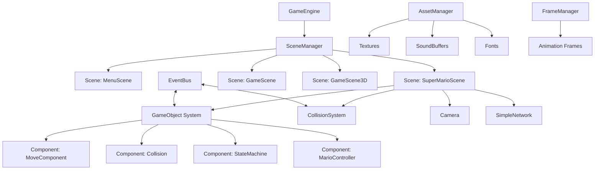
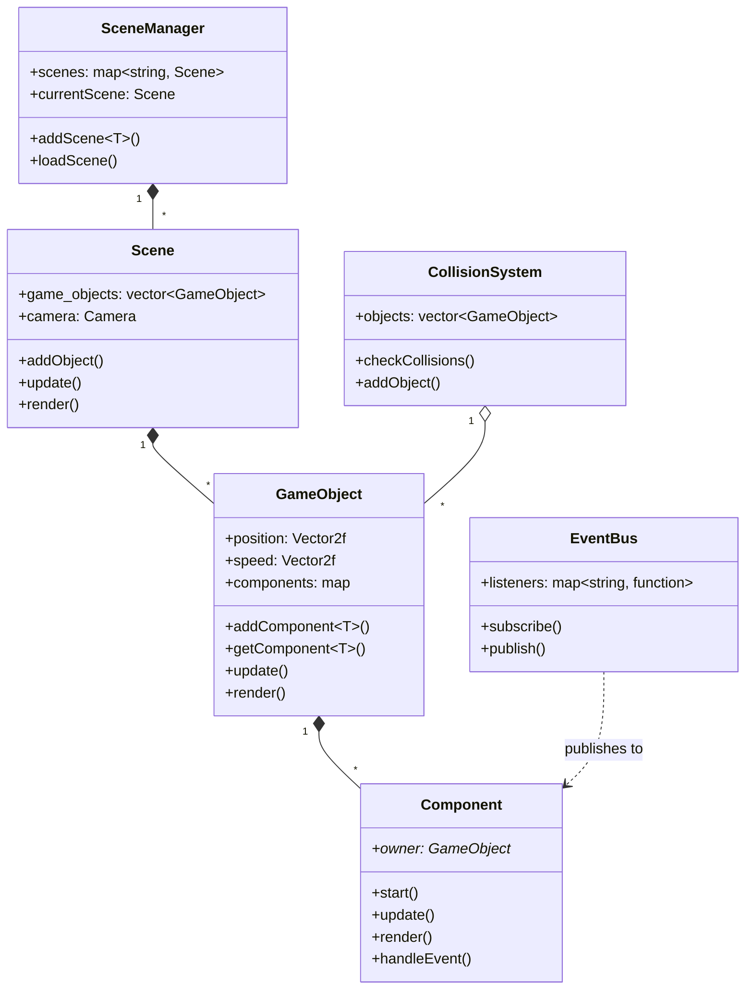

# GameEngine 项目详细文档（2026.3.26）

> 注：本文档为AI生成。

## 目录
1. [项目概述](#项目概述)
2. [技术架构](#技术架构)
3. [核心系统设计](#核心系统设计)
4. [游戏对象系统](#游戏对象系统)
5. [组件系统](#组件系统)
6. [状态机系统](#状态机系统)
7. [场景管理](#场景管理)
8. [资源管理](#资源管理)
9. [网络系统](#网络系统)
10. [物理与碰撞系统](#物理与碰撞系统)
11. [项目结构](#项目结构)
12. [开发指南](#开发指南)

---

## 项目概述

### 简介
GameEngine 是一个基于 C++17 和 SFML 2.6.1 开发的 2D 游戏引擎框架原型。该项目采用类似 Unity 的组件化架构设计，实现了游戏引擎中基础的管理模块和功能系统。

### 主要特性
- **组件化架构**：游戏对象通过组合不同组件实现功能
- **碰撞检测系统**：支持圆形和矩形碰撞体
- **事件总线机制**：实现组件间松耦合通信
- **物理系统**：重力、移动控制等基础物理功能
- **相机系统**：支持跟随、缩放、鼠标控制
- **场景管理**：多场景切换和管理
- **状态机系统**：用于角色行为状态管理
- **网络同步**：支持 TCP 多人联机（服务器/客户端模式）
- **动画系统**：基于帧的 2D 动画支持

### 技术栈
- **编程语言**: C++17
- **图形库**: SFML 2.6.1 (Simple and Fast Multimedia Library)
- **构建系统**: CMake 3.20+
- **开发环境**: CLion
- **JSON 库**: nlohmann/json

---

## 技术架构

### 整体架构图




### 核心类关系图




---

## 核心系统设计

### 1. GameEngine 主引擎类

**职责**: 引擎入口和核心循环控制

**关键方法**:
- `init()`: 初始化窗口、加载资源、注册场景
- `start()`: 启动主循环（事件处理→更新→渲染）

**初始化流程**:
1. 加载 SuperMario 场景资源（纹理、音效、动画帧）
2. 创建 1200x960 的游戏窗口
3. 实例化 SceneManager
4. 注册所有场景（GameScene、GameScene3D、SuperMarioScene、MenuScene）
5. 加载初始场景（MenuScene）

**主循环逻辑**:
```cpp
while (window->isOpen()) {
    // 1. 处理事件
    pollEvent(event);
    scene_manager->handleEvent(event);
    
    // 2. 更新场景（固定时间步长）
    scene_manager->update(deltaTime);
    
    // 3. 渲染场景
    window->clear();
    scene_manager->render(window);
    window->display();
}
```


---

### 2. 事件总线系统 (EventBus)

**设计模式**: 单例模式 + 观察者模式

**核心功能**:
- 基于字符串的事件名称注册
- 支持任意类型的事件数据（std::any）
- 一对多的事件分发机制

**使用示例**:
```cpp
// 订阅碰撞事件
EventBus::getInstance().subscribe<CollisionEvent>(
    "onCollisionPlayer",
    [](CollisionEvent event) {
        // 处理碰撞逻辑
    }
);

// 发布碰撞事件
EventBus::getInstance().publish(
    "onCollisionPlayer",
    CollisionEvent{objA, objB, speedA, speedB, posA, posB}
);
```


---

### 3. 场景上下文 (SceneContext)

**设计模式**: 单例模式

**职责**: 提供全局访问点，存储场景运行时信息

**存储内容**:
- `RenderWindow*`: 当前窗口
- `Camera*`: 当前相机
- `vector<GameObject>*`: 游戏对象列表
- `SceneManager*`: 场景管理器

**典型用途**:
```cpp
// 在组件中访问相机
Camera* camera = SceneContext::getInstance().getCamera();
camera->setPosition(player->getPosition().x - 200, 0);

// 获取鼠标位置（已转换到世界坐标）
sf::Vector2i mousePos = SceneContext::getInstance().getMousePosition();
```


---

## 游戏对象系统

### GameObject 基类

**核心属性**:
- `position`: 世界坐标位置
- `speed`: 速度向量
- `components`: 组件映射表
- `tag`: 对象标签（用于事件订阅）
- `id`: 唯一标识符

**生命周期方法**:
1. `start()`: 首次激活时调用
2. `update(deltaTime)`: 每帧更新
3. `render(window)`: 每帧渲染
4. `handleEvent(event)`: 事件处理

**组件管理**:
```cpp
// 添加组件
auto moveComponent = gameObject.addComponent<MoveComponent>();

// 获取组件
auto collision = gameObject.getComponent<Collision, BoxCollision>();

// 检查组件存在
if (gameObject.hasComponent<GravityComponent>()) { ... }
```


### 主要游戏对象类型

#### 2D 对象
- **BoxGameObject**: 矩形对象，支持碰撞
- **Circle**: 圆形对象，支持碰撞
- **Button**: 可交互按钮
- **Ground**: 静态地形/墙壁
- **Brick**: 可破坏砖块
- **Box**: 特殊道具箱
- **Player**: 玩家角色（圆形碰撞）
- **Mario**: 马里奥角色（带状态机）

#### 3D 对象（线框渲染）
- **GameObject3D**: 3D 对象基类
- **Cube3D**: 立方体
- **Human3D**: 人形模型（OBJ）
- **Penguin3D**: 企鹅模型（OBJ）
- **NewModel3D**: 自定义 OBJ 模型

---

## 组件系统

### 基础组件

#### Component 基类
所有组件的抽象基类，定义生命周期接口：
- `start()`: 初始化
- `update(deltaTime)`: 更新逻辑
- `render(window)`: 渲染
- `handleEvent(event)`: 事件处理

### 核心功能组件

#### 1. MoveComponent（移动组件）
**职责**: 处理对象移动和位置更新

**关键方法**:
- `setPosition(x, y)`: 设置位置（可选是否同步碰撞体）
- `setSpeed(vx, vy)`: 设置速度
- `addPosition(delta)`: 相对移动
- `addSpeed(delta)`: 加速度
- `drawArrow()`: 调试可视化（绘制速度箭头）

**更新逻辑**:
```cpp
void update(const sf::Time& deltaTime) override {
    owner->position += owner->speed * deltaTime.asSeconds();
    setPosition(owner->position.x, owner->position.y);
}
```


#### 2. GravityComponent（重力组件）
**职责**: 施加重力加速度

**参数**:
- `gravity = 3200.f`: 重力常数

**逻辑**:
```cpp
void update(const sf::Time& deltaTime) override {
    float worldHeight = SceneContext::getInstance().getWindowHeight();
    
    // 检测是否已落地
    if (abs(position.y + size.y - worldHeight) < 0.1f && 
        abs(speed.y) <= 1.f) return;
    
    // 应用重力
    moveComponent->setSpeedY(speed.y + gravity * deltaTime.asSeconds());
}
```


#### 3. Collision 组件（碰撞体基类）
**职责**: 定义碰撞体属性和检测接口

**核心属性**:
- `position`: 碰撞体位置
- `offset`: 相对于对象的偏移量
- `getCollisionPosition()`: 返回实际检测位置（position + offset）

**派生类**:
- **BoxCollision**: 矩形碰撞体
- **CircleCollision**: 圆形碰撞体

**碰撞检测方法**:
```cpp
virtual bool checkCollision(const Collision& other) const = 0;
virtual bool checkCollisionWithCircle(const CircleCollision& other) const = 0;
virtual bool checkCollisionWithBox(const BoxCollision& other) const = 0;
```


#### 4. MarioCameraComponent（相机跟随组件）
**职责**: 控制相机跟随玩家

**逻辑**:
```cpp
void update(const sf::Time& deltaTime) override {
    Camera* camera = SceneContext::getInstance().getCamera();
    // X 轴跟随，保持玩家在屏幕左侧 200 像素处
    if (owner->getPosition().x > 200) {
        camera->setPositionX(owner->getPosition().x - 200);
    }
}
```


#### 5. MarioController（玩家控制器）
**职责**: 处理玩家输入并转换为动作

**输入映射**:
- `W`: 跳跃（jump）
- `A`: 向左跑（runLeft）
- `D`: 向右跑（runRight）
- `松开 A/D`: 停止奔跑（stopRun）

**跳跃逻辑**:
```cpp
void jump() const {
    auto moveComponent = owner->getComponent<MoveComponent>();
    if (!moveComponent) moveComponent = owner->addComponent<MoveComponent>();
    
    auto state = owner->getComponent<StateMachine>();
    // 仅在地面时起跳
    if (state && state->getCurrentStateName() != "MarioJumpState")
        moveComponent->setSpeedY(-900.f);
}
```


---

## 状态机系统

### StateMachine（状态机组件）

**职责**: 管理对象的状态切换和行为

**核心方法**:
- `addState<T>()`: 添加状态
- `setState(name)`: 切换到指定状态
- `getCurrentStateName()`: 获取当前状态名
- `getCurrentState()`: 获取当前状态对象

**状态生命周期**:
1. `start()`: 进入状态时调用
2. `update(deltaTime)`: 每帧更新
3. `render(window)`: 渲染状态相关视觉
4. `handleEvent(event)`: 处理输入
5. `stop()`: 离开状态时调用

**使用示例**:
```cpp
// 为 Mario 添加状态机
auto stateMachine = mario->addComponent<StateMachine>();

// 添加状态
stateMachine->addState<MarioIdleState>();
stateMachine->addState<MarioRunState>();
stateMachine->addState<MarioJumpState>();

// 设置初始状态
stateMachine->setState("MarioIdleState");
```


### 马里奥状态实现

#### MarioIdleState（待机状态）
**行为**:
- 监听键盘输入
- W 键 → 切换到 JumpState
- A/D 键 → 标记方向，准备切换到 RunState

**渲染**:
- 根据朝向显示左右镜像的马里奥精灵

#### MarioRunState（奔跑状态）
**行为**:
- 播放奔跑动画
- 速度为 0 时切回 IdleState
- 跳跃时切换到 JumpState

**动画**:
- 从 FrameManager 加载动画帧
- 支持往返播放（back=true）

#### MarioJumpState（跳跃状态）
**行为**:
- 禁用水平移动控制
- 监听 W 键松开（控制跳跃高度）
- 落地后自动切回 IdleState

**特殊机制**:
- `jumpTimer`: 控制跳跃动画时长
- `w_is_pressed`: 检测是否长按跳跃键

---

## 场景管理

### Scene 基类

**职责**: 管理游戏对象集合和场景生命周期

**核心方法**:
- `init()`: 场景初始化
- `exit()`: 场景退出清理
- `update(deltaTime)`: 场景更新
- `render(window)`: 场景渲染
- `handleEvent(event)`: 事件分发

**游戏对象管理**:
- `addObject(obj)`: 添加对象
- `addObjectWithMap(obj)`: 添加对象并建立 ID 映射
- `addObjectWithNetwork(obj)`: 添加对象并注册网络同步
- `findGameObjectById(id)`: 按 ID 查找
- `removeObjectById(id)`: 删除对象

### SuperMarioScene（超级马里奥场景）

**初始化流程**:
1. 创建碰撞系统
2. 加载背景纹理
3. 初始化静态对象（墙壁、地面、砖块）
4. 动态生成玩家（网络模式下由服务器控制）

**静态对象配置**:
- **左墙**: x=0, y=0, w=10, h=960
- **地面**: 多段拼接（总长度约 14535 像素）
- **砖块**: 7 个固定位置的砖块
- **道具箱**: 1 个特殊箱子

**碰撞检测更新**:
```cpp
void update(sf::Time deltaTime) override {
    Scene::update(deltaTime);
    // 执行碰撞检测
    collisionSystem->checkCollisions();
    // 网络同步
    simple_network.update(deltaTime);
}
```


**场景切换**:
- ESC 键 → 返回 MenuScene

---

## 资源管理

### AssetManager（资源管理器）

**设计模式**: 单例模式

**管理的资源类型**:
1. **纹理（Texture）**: PNG 图像文件
2. **音效缓冲（SoundBuffer）**: OGG 音频文件
3. **字体（Font）**: TTF 字体文件

**加载机制**:
```cpp
// 批量加载纹理（递归扫描目录）
void loadTexture(const char* path) {
    for (const auto& entry : std::filesystem::recursive_directory_iterator(path)) {
        std::string extension = entry.path().extension().string();
        if (extension != ".png") continue;
        
        std::string file_name = entry.path().stem().string();
        textures[file_name].loadFromFile(entry.path().string());
    }
}

// 获取纹理
sf::Texture& getTexture(const std::string& name);
```


**资源命名约定**:
- 文件名（不含扩展名）作为资源键名
- 例如：`mario_bros.png` → `AssetManager::getTexture("mario_bros")`

### FrameManager（动画帧管理器）

**设计模式**: 单例模式

**职责**: 加载和管理 2D 动画帧数据

**数据来源**: JSON 配置文件
- `./Asset/SuperMario/source/data/player/mario.json`
- `./Asset/SuperMario/source/data/player/box.json`

**帧数据结构**:
```cpp
struct Frame {
    sf::Texture* texture;      // 纹理引用
    sf::IntRect textureRect;   // 纹理区域
    sf::Vector2f origin;       // 原点
    sf::Vector2f scale;        // 缩放
    unsigned int duration;     // 持续时间（毫秒）
};
```


---

## 网络系统

### SimpleNetwork（简单网络同步）

**网络模式**:
- **Server**: TCP 监听器，等待客户端连接
- **Client**: 连接到服务器
- **None**: 单机模式

**端口**: 8888

### 服务器端逻辑

#### 1. 接受连接
```cpp
bool startServer() {
    listener.listen(port);
    listener.setBlocking(false);
    network_type = NetworkType::Server;
}
```


#### 2. 新客户端加入流程
当检测到新连接时：
1. 发送当前场景中所有对象的状态
2. 创建新的 Mario 玩家对象
3. 向所有现有客户端广播新玩家信息
4. 向新玩家发送自身数据

**数据包格式**（类型 0 = 对象创建）:
```cpp
packet << 0;  // 包类型：创建对象

// 对象类型 0 = Mario
packet << 1 
       << x << y << speedX << speedY << isJump
       << id;

// 对象类型 2 = Player（圆形）
packet << 2 
       << x << y << speedX << speedY << radius
       << id;

// 对象类型 3 = BoxGameObject
packet << 3 
       << x << y << speedX << speedY << width << height
       << id;
```


#### 3. 处理客户端输入
接收客户端操作指令：
- `0`: 跳跃（W 键按下）
- `1`: 左跑（A 键按下）
- `2`: 右跑（D 键按下）
- `3/4`: 停止奔跑（A/D 键松开）
- `5`: 跳跃键松开（W 键释放）

#### 4. 状态同步
每 50ms 向所有客户端发送一次全量状态：
```cpp
for (const auto& client : clients) {
    for (const auto& obj : game_objects) {
        packet << 1;  // 包类型：状态更新
        
        if (obj->getClassName() == "Mario") {
            packet << 0  // Mario 类型
                   << x << y << speedX << speedY << isJump
                   << id;
        } else {
            packet << 1  // 其他对象
                   << x << y << speedX << speedY
                   << id;
        }
    }
}
```


#### 5. 客户端断开处理
```cpp
if (status == sf::Socket::Disconnected) {
    // 1. 从玩家列表移除
    players.erase(client.get());
    
    // 2. 从游戏对象列表删除
    game_objects.erase(obj_it);
    
    // 3. 通知其他客户端删除该玩家
    packet << 2 << playerId;
    for (const auto& c : clients) c.send(packet);
}
```


### 客户端逻辑

#### 1. 连接服务器
```cpp
bool connectToServer(const std::string& address) {
    clientSocket.connect(address, port, sf::seconds(5));
    clientSocket.setBlocking(false);
    network_type = NetworkType::Client;
}
```


#### 2. 接收场景初始化
首次连接时接收所有现有对象：
- 创建本地 Mario（如果是玩家自己）
- 创建其他 Mario（其他玩家）
- 创建 Player（圆形角色）
- 创建 BoxGameObject（箱子）

#### 3. 发送本地输入
```cpp
void handleEvent(const sf::Event& event) {
    if (event.type == sf::Event::KeyPressed) {
        if (event.key.code == sf::Keyboard::W) {
            packet << 0;  // 跳跃
            clientSocket.send(packet);
        }
        // ... 其他按键
    }
}
```


#### 4. 接收状态同步
```cpp
void clientUpdate(const sf::Time& deltaTime) {
    sf::Packet packet;
    clientSocket.receive(packet);
    
    int type;
    packet >> type;
    
    if (type == 0) {
        // 创建新对象
        // ...
    } else if (type == 1) {
        // 更新对象状态
        float x, y, s_x, s_y;
        unsigned int id;
        packet >> x >> y >> s_x >> s_y >> id;
        
        auto player = findGameObjectById(id);
        player->getComponent<MoveComponent>()->setPosition(x, y);
        player->getComponent<MoveComponent>()->setSpeed(s_x, s_y);
    } else if (type == 2) {
        // 删除对象
        unsigned int id;
        packet >> id;
        removeObjectById(id);
    }
}
```


---

## 物理与碰撞系统

### CollisionSystem（碰撞系统）

**职责**: 管理所有碰撞体并执行碰撞检测

**核心方法**:
```cpp
void addObject(const std::shared_ptr<GameObject>& obj);
void checkCollisions() const;
std::vector<std::shared_ptr<GameObject>>* getObjects();
```


### 碰撞检测算法

#### 检测流程
```cpp
void checkCollisions() const {
    for (size_t i = 0; i < objects.size(); i++) {
        for (size_t j = i + 1; j < objects.size(); j++) {
            const auto a = objects[i];
            const auto b = objects[j];
            
            // 跳过两个静态物体
            if (!a->getMoveAble() && !b->getMoveAble()) continue;
            
            // 获取碰撞体组件
            const auto a_c = a->getComponent<Collision>();
            if (!a_c) continue;
            
            // 执行碰撞检测
            if (auto b_c = b->getComponent<Collision>(); 
                a_c->checkCollision(*b_c)) {
                
                // 发布碰撞事件
                EventBus::getInstance().publish(
                    "onCollision" + a->getTag(),
                    CollisionEvent{a, b, a_speed, b_speed, a_pos, b_pos}
                );
                
                EventBus::getInstance().publish(
                    "onCollision" + b->getTag(),
                    CollisionEvent{b, a, b_speed, a_speed, b_pos, a_pos}
                );
            }
        }
    }
}
```


#### BoxCollision vs BoxCollision
矩形碰撞检测（AABB）：
```cpp
bool checkCollisionWithBox(const BoxCollision& other) const override {
    return !(this->right() < other.left()  ||
             this->left()  > other.right() ||
             this->bottom() < other.top()  ||
             this->top()    > other.bottom());
}
```


#### CircleCollision vs CircleCollision
圆形碰撞检测：
```cpp
bool checkCollisionWithCircle(const CircleCollision& other) const override {
    sf::Vector2f delta = other.getCollisionPosition() - getCollisionPosition();
    float distanceSquared = delta.x * delta.x + delta.y * delta.y;
    float radiusSum = getRadius() + other.getRadius();
    return distanceSquared <= radiusSum * radiusSum;
}
```


#### BoxCollision vs CircleCollision
矩形 - 圆形碰撞检测：
```cpp
bool checkCollision(const Collision& other) const override {
    // 找到矩形上离圆心最近的点
    sf::Vector2f closestPoint(
        std::clamp(circlePos.x, left(), right()),
        std::clamp(circlePos.y, top(), bottom())
    );
    
    // 计算最近点到圆心的距离
    sf::Vector2f delta = circlePos - closestPoint;
    float distanceSquared = delta.x * delta.x + delta.y * delta.y;
    
    return distanceSquared <= circleRadius * circleRadius;
}
```


---

## 项目结构

### 目录结构
```
GameEngine/
├── src/                          # 源代码目录
│   ├── Components/               # 组件
│   │   ├── Collisions/          # 碰撞体组件
│   │   │   ├── Collision.h      # 碰撞体基类
│   │   │   ├── BoxCollision.h/cpp
│   │   │   └── CircleCollision.h/cpp
│   │   ├── CollisionHandles/    # 碰撞处理组件
│   │   ├── CameraComponent.h    # 相机组件
│   │   ├── MarioCameraComponent.h
│   │   ├── MarioController.h    # 玩家控制器
│   │   ├── MoveComponent.h      # 移动组件
│   │   ├── GravityComponent.h   # 重力组件
│   │   └── Component.h          # 组件基类
│   │
│   ├── GameObjects/             # 游戏对象
│   │   ├── GameObject.h         # 对象基类
│   │   ├── GameObject3D.h       # 3D 对象基类
│   │   ├── Box.h                # 箱子
│   │   ├── BoxGameObject.h      # 矩形对象
│   │   ├── Brick.h              # 砖块
│   │   ├── Button.h             # 按钮
│   │   ├── Circle.h             # 圆形对象
│   │   ├── Cube3D.h             # 立方体
│   │   ├── Ground.h             # 地面
│   │   ├── Human3D.h            # 人形模型
│   │   ├── Mario.h              # 马里奥
│   │   ├── Penguin3D.h          # 企鹅模型
│   │   ├── Player.h             # 玩家
│   │   └── NewModel3D.h         # 自定义模型
│   │
│   ├── Scene/                   # 场景
│   │   ├── Scene.h              # 场景基类
│   │   ├── SceneContext.h       # 场景上下文
│   │   ├── GameScene.h          # 测试场景
│   │   ├── GameScene3D.h        # 3D 测试场景
│   │   ├── MenuScene.h          # 菜单场景
│   │   └── SuperMarioScene.h    # 马里奥场景
│   │
│   ├── State/                   # 状态机
│   │   ├── BaseState.h          # 状态基类
│   │   ├── StateMachine.h       # 状态机组件
│   │   ├── MarioIdleState.h     # 待机状态
│   │   ├── MarioRunState.h      # 奔跑状态
│   │   └── MarioJumpState.h     # 跳跃状态
│   │
│   ├── Manager/                 # 管理器
│   │   ├── AssetManager.h       # 资源管理
│   │   ├── FrameManager.h/cpp   # 动画帧管理
│   │   ├── SceneManager.h       # 场景管理
│   │   └── ModelManager.h       # 3D 模型管理
│   │
│   ├── Animation.h              # 动画系统
│   ├── Camera.h                 # 相机
│   ├── CollisionSystem.h        # 碰撞系统
│   ├── EventBus.h               # 事件总线
│   ├── Events.h                 # 事件定义
│   ├── Timer.h                  # 计时器
│   ├── SimpleNetwork.h          # 网络同步
│   ├── GameEngine.h             # 引擎主类
│   └── main.cpp                 # 程序入口
│
├── Asset/                       # 资源文件
│   ├── Font/                    # 字体
│   │   └── Minecraft_AE.ttf
│   ├── SuperMario/              # 马里奥资源
│   │   ├── resources/
│   │   │   ├── graphics/        # 贴图
│   │   │   └── sound/           # 音效
│   │   └── source/data/
│   │       └── player/          # 动画数据
│   │           ├── mario.json
│   │           └── box.json
│   ├── cube.obj                 # 立方体模型
│   ├── human.obj                # 人形模型
│   ├── penguin.obj              # 企鹅模型
│   └── new_model.obj            # 自定义模型
│
├── lib/                         # 第三方库
│   ├── SFML-2.6.1-gcc/          # SFML 库
│   └── nlohmann/                # JSON 库
│
├── cmake-build-debug/           # Debug 构建目录
├── cmake-build-release/         # Release 构建目录
├── CMakeLists.txt               # CMake 配置
├── README.md                    # 项目说明
└── .gitignore                   # Git 忽略配置
```


### 文件统计
- **头文件 (.h)**: 约 40+
- **源文件 (.cpp)**: 约 10+
- **总代码行数**: 约 5000+ 行

---

## 开发指南

### 1. 创建新场景

```cpp
// 1. 继承 Scene 类
class MyScene : public Scene {
public:
    explicit MyScene(sf::RenderWindow* _window) 
        : Scene(_window, "MyScene") {}
    
    void init() override {
        Scene::init();
        // 初始化代码
        addObject(std::make_shared<BoxGameObject>(100.f, 100.f, 50.f, 50.f));
    }
    
    void render(sf::RenderWindow* _window) override {
        // 自定义渲染
        Scene::render(_window);
    }
};

// 2. 在 GameEngine::init() 中注册
scene_manager->addScene<MyScene>(window);
scene_manager->loadScene("MyScene");
```


### 2. 创建新游戏对象

```cpp
// 1. 继承 GameObject
class Enemy : public GameObject {
public:
    Enemy(float x, float y) {
        position = {x, y};
        tag = "Enemy";
        
        // 添加碰撞体
        addComponent<Collision, BoxCollision>();
        
        // 添加移动组件
        addComponent<MoveComponent>();
        
        // 添加重力
        addComponent<GravityComponent>();
    }
    
    void update(const sf::Time& deltaTime) override {
        GameObject::update(deltaTime);
        // 自定义 AI 逻辑
    }
};

// 2. 在场景中使用
auto enemy = std::make_shared<Enemy>(200.f, 300.f);
addObject(enemy);
```


### 3. 创建新组件

```cpp
// 1. 继承 Component
class HealthComponent : public Component {
public:
    explicit HealthComponent(int maxHealth) 
        : health(maxHealth), maxHealth(maxHealth) {}
    
    void update(const sf::Time& deltaTime) override {
        if (health <= 0) {
            // 死亡逻辑
            owner->setActive(false);
        }
    }
    
    void takeDamage(int damage) {
        health -= damage;
    }
    
    [[nodiscard]] int getHealth() const {
        return health;
    }
    
private:
    int health;
    int maxHealth;
};

// 2. 添加到对象
enemy->addComponent<HealthComponent>(100);
```


### 4. 创建新状态

```cpp
// 1. 继承 BaseState
class EnemyAttackState : public BaseState {
public:
    EnemyAttackState() : BaseState("EnemyAttackState") {}
    
    void start() override {
        // 进入攻击状态
        attackTimer = 0.f;
    }
    
    void update(const sf::Time& deltaTime) override {
        attackTimer += deltaTime.asSeconds();
        if (attackTimer > 1.0f) {
            // 攻击完成，返回待机
            owner->getComponent<StateMachine>()->setState("EnemyIdleState");
        }
    }
    
    void handleEvent(const sf::Event& event) override {
        // 处理输入或事件
    }
    
    void render(sf::RenderWindow* window) override {
        // 渲染攻击动画
    }
    
private:
    float attackTimer;
};

// 2. 添加到状态机
stateMachine->addState<EnemyAttackState>();
```


### 5. 订阅事件

```cpp
// 订阅碰撞事件
EventBus::getInstance().subscribe<CollisionEvent>(
    "onCollisionEnemy",
    [](CollisionEvent event) {
        auto enemy = event.a;
        auto other = event.b;
        
        if (other->getTag() == "Player") {
            // 与玩家碰撞，造成伤害
            auto health = enemy->getComponent<HealthComponent>();
            if (health) health->takeDamage(10);
        }
    }
);
```


### 6. 使用网络同步

```cpp
// 在场景中启用网络
class MyScene : public Scene {
private:
    SimpleNetwork network;
    
    void init() override {
        // 作为服务器启动
        if (network.startServer()) {
            std::cout << "Server started!" << std::endl;
        }
        
        // 或作为客户端连接
        // network.connectToServer("127.0.0.1");
    }
    
    void update(sf::Time deltaTime) override {
        Scene::update(deltaTime);
        network.update(deltaTime);  // 同步网络数据
    }
    
    void handleEvent(sf::Event& event) override {
        network.handleEvent(event);  // 发送玩家输入
        Scene::handleEvent(event);
    }
};
```


### 7. 加载和使用资源

```cpp
// 加载资源（通常在 GameEngine::init 中）
AssetManager::getInstance().loadTexture("./Asset/MyGame/graphics");
AssetManager::getInstance().loadSoundBuffer("./Asset/MyGame/sound");

// 使用资源
sf::Sprite sprite;
sprite.setTexture(AssetManager::getInstance().getTexture("player_sprite"));

sf::Sound sound;
sound.setBuffer(AssetManager::getInstance().getSoundBuffer("jump_sound"));
sound.play();
```


### 8. 调试技巧

**显示碰撞体**:
```cpp
// 在 BoxCollision::render 中添加调试绘制
void render(sf::RenderWindow* window) override {
    sf::RectangleShape debugShape(getSize());
    debugShape.setPosition(getCollisionPosition());
    debugShape.setFillColor(sf::Color::Transparent);
    debugShape.setOutlineColor(sf::Color::Red);
    debugShape.setOutlineThickness(2.f);
    window->draw(debugShape);
}
```


**显示速度向量**:
```cpp
// MoveComponent 默认绘制速度箭头
// 红色箭头表示当前速度方向
```


**打印日志**:
```cpp
// 在关键位置输出调试信息
std::cout << "Player position: " 
          << player->getPosition().x << ", " 
          << player->getPosition().y << std::endl;
```


---

## 附录

### A. 快捷键参考

#### 通用控制
- `ESC`: 返回菜单
- `方向键/WASD`: 相机移动（部分场景）
- `鼠标滚轮`: 相机缩放
- `鼠标拖拽`: 相机平移

#### SuperMarioScene 控制
- `W`: 跳跃
- `A`: 向左移动
- `D`: 向右移动
- `ESC`: 返回菜单

### B. 网络协议

#### 服务器→客户端 数据包

**类型 0: 对象创建**
```cpp
packet << 0;          // 包类型
packet << obj_type;   // 对象类型 (0=Mario, 1=Mario_NPC, 2=Player, 3=Box)

switch(obj_type) {
    case 0: // Mario
        packet << x << y << speedX << speedY << isJump << id;
        break;
    case 2: // Player (圆形)
        packet << x << y << speedX << speedY << radius << id;
        break;
    case 3: // Box
        packet << x << y << speedX << speedY << width << height << id;
        break;
}
```


**类型 1: 状态更新**
```cpp
packet << 1;          // 包类型
packet << obj_type;   // 0=Mario, 1=Other

if (obj_type == 0) {
    packet << x << y << speedX << speedY << isJump << id;
} else {
    packet << x << y << speedX << speedY << id;
}
```


**类型 2: 对象删除**
```cpp
packet << 2 << id;
```


#### 客户端→服务器 数据包

**按键事件**
```cpp
packet << 0;  // W 按下 - 跳跃
packet << 1;  // A 按下 - 左跑
packet << 2;  // D 按下 - 右跑
packet << 3;  // A 松开 - 停跑
packet << 4;  // D 松开 - 停跑
packet << 5;  // W 松开 - 结束跳跃
```


### C. JSON 动画配置示例

```json
{
  "animations": {
    "idle": {
      "frames": [
        {
          "texture": "mario_bros",
          "rect": [178, 32, 12, 16],
          "duration": 100
        }
      ]
    },
    "run": {
      "back": true,
      "frames": [
        {
          "texture": "mario_bros",
          "rect": [178, 32, 12, 16],
          "duration": 100
        },
        {
          "texture": "mario_bros",
          "rect": [210, 32, 12, 16],
          "duration": 100
        }
      ]
    }
  }
}
```


### D. 常见问题

**Q: 编译时找不到 SFML 库**
A: 修改 `CMakeLists.txt` 中的 `SFML_ROOT` 路径为你的 SFML 安装目录

**Q: 运行时提示资源加载失败**
A: 确保工作目录正确，资源路径相对于可执行文件位置

**Q: 网络联机失败**
A: 检查防火墙设置，确保 8888 端口未被阻止

**Q: 碰撞检测不准确**
A: 调整碰撞体的 `offset` 属性以匹配视觉表现

---

## 总结

本项目实现了一个功能完整的 2D 游戏引擎框架，包含：

✅ **核心系统**: 场景管理、游戏对象、组件化架构  
✅ **物理系统**: 重力、碰撞检测（AABB/圆形）  
✅ **渲染系统**: 2D 精灵、3D 线框、动画播放  
✅ **输入系统**: 键盘事件、玩家控制  
✅ **网络系统**: TCP 多人联机、状态同步  
✅ **资源管理**: 纹理、音效、字体、动画帧  

**适用场景**:
- 学习游戏引擎架构设计
- 快速原型开发
- 理解组件化思想
- 研究网络同步技术

**扩展方向**:
- 添加更多物理效果（摩擦力、弹力）
- 实现粒子系统
- 支持 Tilemap 地图编辑
- 增加 UI 系统
- 实现脚本系统（Lua/Python）
- 添加音频管理器（背景音乐控制）

---

*文档生成时间：2026-03-26*  
*项目版本：基于最新提交*