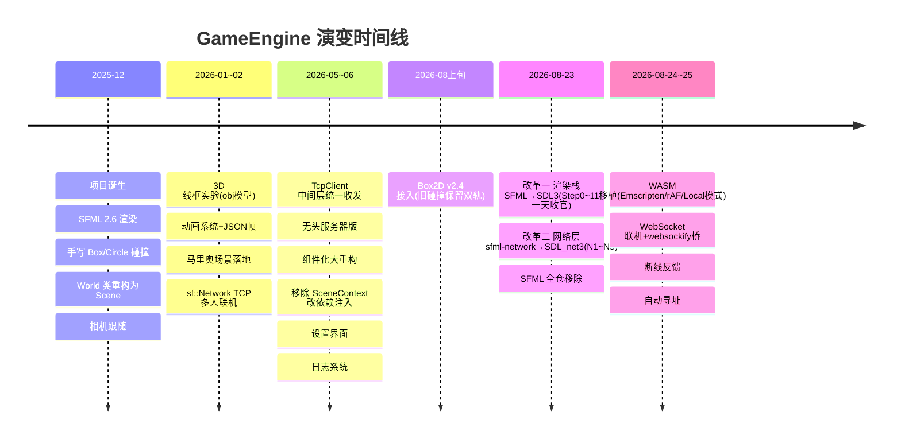
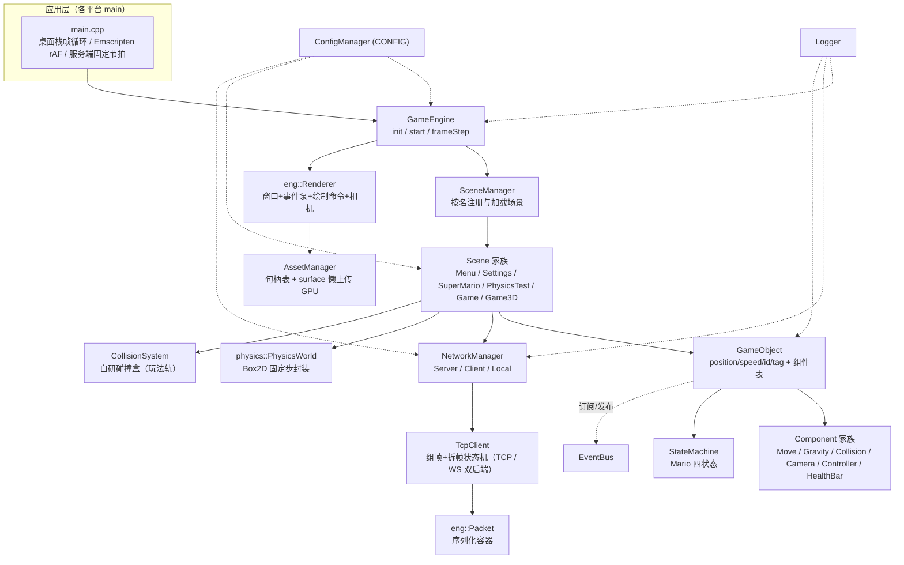
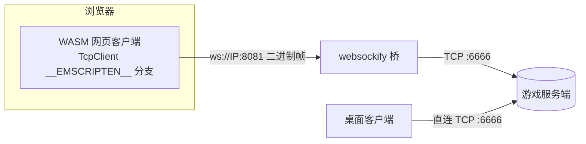
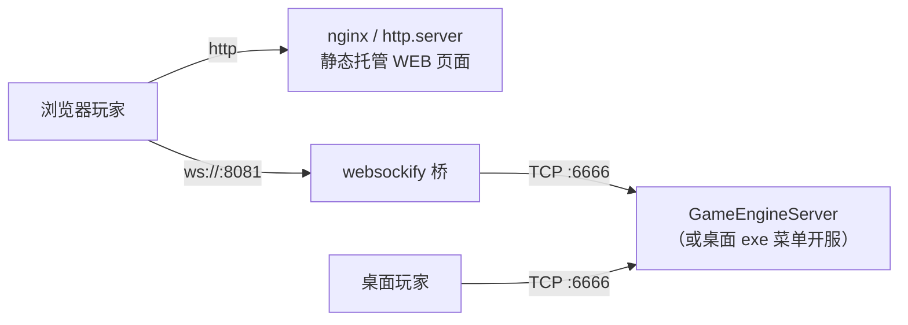

# GameEngine 项目详细文档（2026.8.26）

> 注：本文档为 AI 生成，基于 git 全部提交历史与 `src/` 源码逐文件核对撰写。
> 构建 / 运行 / 部署速查见 [README](../README.md)；各专题计划文档见[文末索引](#附录-f-专题文档索引)。

**项目地址**：<https://github.com/minecraftbucuo/GameEngine>

## 目录

- [一、项目概述](#一、项目概述)
- [二、演变史：从 SFML 到 SDL 的改革（git 考古）](#二、演变史-从-sfml-到-sdl-的改革-git-考古)
- [三、技术架构](#三、技术架构)
- [四、核心系统设计](#四、核心系统设计)
- [五、游戏对象系统](#五、游戏对象系统)
- [六、组件系统](#六、组件系统)
- [七、状态机系统](#七、状态机系统)
- [八、场景管理](#八、场景管理)
- [九、资源管理](#九、资源管理)
- [十、网络系统](#十、网络系统)
- [十一、物理与碰撞系统](#十一、物理与碰撞系统)
- [十二、音频系统](#十二、音频系统)
- [十三、项目结构](#十三、项目结构)
- [十四、构建系统](#十四、构建系统)
- [十五、平台差异与移植层](#十五、平台差异与移植层)
- [十六、开发指南](#十六、开发指南)
- [十七、附录](#十七、附录)

---

## 一、项目概述

### 简介

GameEngine 是一个基于 **C++20 和 SDL3** 开发的 2D 游戏引擎框架，采用类似 Unity 的组件化架构设计。项目围绕一个可多人联机对战的超级马里奥 Demo 持续演进，同时保留 3D 线框演示场景与 Box2D 物理测试场景。全仓约 **9100 行 C++**（`src/`），第三方依赖只有 SDL3 全家与 Box2D，全部由 CMake FetchContent 拉取源码静态编译。

### 主要特性

- **组件化架构**：游戏对象通过组合不同组件实现功能（移动 / 重力 / 碰撞 / 相机 / 血条 / 控制器…）
- **渲染抽象层**：`eng::Renderer` 绘制命令层，头文件零第三方依赖，后端实现整体可替换（已完成 SFML→SDL3 替换）
- **双轨物理**：自研组件式碰撞盒（马里奥玩法）+ Box2D v2.4 刚体世界（物理测试场景）
- **事件总线**：字符串主题 + 类型擦除的松耦合通信
- **状态机系统**：角色行为状态管理（马里奥待机 / 奔跑 / 跳跃 / 死亡）
- **权威服务端联机**：TCP C/S 架构，客户端预测 + 服务端快照纠偏，SDL_net 3 实现
- **浏览器运行**：Emscripten WASM 移植；网页玩家经 websockify 桥接入同一服务端
- **动画系统**：JSON 驱动的帧动画（帧矩形 / 时长 / 往返播放 / 负缩放镜像）
- **三形态单码库**：桌面客户端 · 无头服务端 · 浏览器 WASM

### 技术栈

| 项 | 内容 |
|---|---|
| 编程语言 | C++20（`std::format` / `std::source_location` / `std::type_index` 组件表） |
| 图形 / 窗口 / 音频 | SDL 3.4.14 + SDL_image 3.2.0 + SDL_ttf 3.2.0 + SDL_mixer 3.2.0 |
| 网络 | SDL_net 3（pin main commit）+ Emscripten WebSocket（Web 端） |
| 物理 | Box2D v2.4.1（可选轨道）；自研 AABB / 圆形碰撞（玩法轨道） |
| 序列化 | 自研 `eng::Packet`（线格式兼容 sf::Packet） |
| JSON | nlohmann/json（配置 + 动画帧 + 关卡地图） |
| 构建 | CMake ≥ 3.26 + FetchContent；Emscripten（emcmake） |

### 三种构建形态

| 形态 | 构建方式 | 产物 | 说明 |
|---|---|---|---|
| 桌面客户端 | `cmake -S . -B build` | `build/bin/GameEngine` | 全功能：窗口 / 渲染 / 音频 / 网络 |
| 无头服务端 | `-DBUILD_FOR_SERVER=ON` | `build-server/server/GameEngineServer` | `SERVER_BUILD` 宏裁掉渲染/音频/窗口，启动即自动开服 |
| Web 版 | `emcmake` 配置（`scripts/build_web.ps1`） | `build-web/web/` 四件套 | WASM；资源打进 `.data` 虚拟盘 |

---

## 二、演变史：从 SFML 到 SDL 的改革（git 考古）

git 历史（2025-12-11 Initial commit 起，130+ 提交）完整记录了项目的四次跃迁。理解这段历史，就理解了当前架构为什么长这样。

### 时间线总览



### 第一阶段：SFML 时代（2025-12 ~ 2026-08 中）

- **2025-12**：初始提交即为 SFML 架构，`sf::RenderWindow` 直接散布在游戏代码里。当月完成 `World → Scene` 拆分（`69838ec`）、相机类与跟随组件（`ad0b79c`）、手写 Box/Circle 碰撞模拟（多球互撞调试系列提交）。
- **2026-01 ~ 02**：
  - 3D 线框实验：旋转立方体（`c1e1982`）、obj 模型懒加载 ModelManager（`6a38b3d`）；
  - 动画系统 + SFML 直接入仓 + **JSON 帧数据加载**（`895bc64`）；
  - 马里奥场景：砖块 / 问号方块 / 状态机 / 碰撞箱偏移机制；
  - **TCP 多人联机**起步（`c38cb99`），逐步演进到多人同图、断线清理（`662507a`）、火球同步对战（`22af796`）。
- **2026-05 ~ 06（内功期，为迁移埋下伏笔）**：
  - `TcpClient` 中间层：要发的数据先暂存、update 完毕统一发送（`01f9940`）——后来成为传输层可替换的关键；
  - 配置管理器 `CONFIG` 宏替代硬编码路径（`e31c708`）；
  - **组件化重构**：GameObject 属性 public → protected（`302c5c5`）、射击跳跃逻辑迁入 `MarioController`（`5cfe5c0`）、组件管理系统重构（`47537ce`）；
  - **自我纠错**：「SceneContext 设计存在问题，现逐步用依赖注入方式代替」（`83d4125`）→「彻底移除 SceneContext」（`502e986`）。这次重构让场景不再经全局上下文拿窗口，而是构造时显式接收渲染器指针——正是 SDL 迁移能平滑进行的结构性前提；
  - 头文件实现拆 cpp 加快增量构建（`59858cd`）。
- **2026-08-18**：接入 Box2D v2.4（`95ea1c3`），新增 `PhysicsWorld` / `PhysicsBodyComponent` / 接触事件桥接，但**有意保留旧自研碰撞系统**跑马里奥玩法——新旧双轨并行至今。

### 第二阶段：改革一 —— 渲染栈 SFML → SDL3（2026-08-23）

**动机**：SFML 2.6 / 3.x 均不支持 Emscripten，Web 版无从谈起；SDL3 官方支持 Emscripten。迁移前全仓统计：**100 个文件、783 处 `sf::` 引用**。

**方法论：薄脚手架 + 原子步进**。不是重写，而是先给现有 SFML 写一个极薄的临时适配实现，把全部游戏代码渐进切到引擎自有 API 上，每一步满足：

> **可编译 · 可运行 · 可回滚** —— 每步 = 一次 git commit = 一个原子操作，单一职责、不破坏既有契约

十一步走完（详见 [sdl3-migration-plan.md](sdl3-migration-plan.md)，含全部实施记录）：

| 步骤 | 内容 | 关键产物 / 影响 |
|---|---|---|
| Step 1 | 数值类型别名化：`sf::Vector2f → eng::Vec2f` 等 8 个别名，90 个文件机械替换 | `Core/Types.h`（别名即原类型，语义零变化） |
| Step 2~3 | 自研事件抽象 + 键码枚举 + 输入轮询；40 个文件的事件链切换 | `Core/Event.h` `KeyCodes.h` `Input.h` |
| Step 4 | 资源句柄类型（纯新增） | `Render/Handles.h` |
| Step 5 | `Renderer` 三合一类接管 GameEngine 的窗口/事件泵/clear/present | `Renderer.h` + `RendererSFML.cpp`（脚手架，内部持 sf::RenderWindow） |
| Step 6a~6e | 渲染链路渐进切绘制命令：基类双签名转发 → 物理场景 → Mario 系 → UI → 3D | 55 处 `window->draw()` 清零 |
| Step 7 | AssetManager 彻底句柄化，删除按名取资源旧 API；Animation 去 `sf::Sprite` 成纯数据 | 外部 API 从此与第三方无关 |
| Step 8~9 | CMake 接入 SDL3 全家（只拉取不链接）；编写 SDL3 实现文件（可编译未启用） | `RendererSDL3.cpp`、`AssetManager.cpp`(SDL版) |
| Step 10 | **一次性切换**：Types.h 别名换自研 struct、CMake 换实现文件、音频直改 SDL_mixer track API | SDL3 生效；关开关即回滚 SFML |
| Step 11 | 删除 4 个脚手架文件，`ENGINE_SDL3` 宏清零 | 渲染/窗口/输入/音频 = 纯 SDL3 |

**架构遗产**（本次改革的真正成果）：游戏层从此零第三方引用——`Renderer.h` 头文件不含任何 SDL include，`sf::Texture` / `SDL_Texture` 全部被 `uint32_t` 句柄挡在 AssetManager 内部。日后若再换后端，理论上只需替换一个 `.cpp`。

### 第三阶段：改革二 —— 网络层 sfml-network → SDL_net 3（同日收官）

渲染迁移完成后，SFML 在仓库里只剩网络一块，当天乘胜追击（详见 [sdl3-net-migration-plan.md](sdl3-net-migration-plan.md)）。采用**两段式切换**：

```
N1  eng::Packet 落盘（自研序列化容器，线格式逐字节复刻 sf::Packet，纯新增零引用）
N2  CMake 接入 SDL_net，SDL 本体提升为两端共用（只拉取，不切源码）
N3  类型层切换：sf::Packet → eng::Packet，传输层仍是 SFML ── 行为等价，可与旧 exe 交叉验证
N4  传输层切换：TcpClient/listener 内部换 NET_StreamSocket ── 游戏层零感知
N5  SFML 全仓移除：lib/ 目录删除，源码与 CMake 零引用（7917945 收官）
```

核心技巧是**线格式兼容**：`eng::Packet` 逐字节复刻 `sf::Packet` 编码（详见 [10.4 节](#_10-4-线格式-eng-packet-流帧)），因此 N3 之后新旧 exe 可以互通联机，天然具备回滚验证手段。至此 **SFML 在依赖图中彻底不存在**。

### 第四阶段：Web 化（2026-08-24 ~ 25）

SDL 化的红利立刻兑现：

1. **Emscripten 移植**（[wasm-web-port-plan.md](wasm-web-port-plan.md)）：CMake 平台分支、主循环回调化（rAF）、引擎堆分配常驻、资源打进 `.data` 虚拟盘、无裸 socket 时降级为 **Local 本地单机模式**；
2. **WebSocket 联机**（[websocket-net-plan.md](websocket-net-plan.md)）：`TcpClient` 增加 `__EMSCRIPTEN__` 分支；服务端前挂 websockify 桥还原裸 TCP，游戏服务端对两种玩家一视同仁；
3. **断线体验**（N4）：CONNECTION LOST 提示层、场景会话重置防"双马里奥"；
4. **自动寻址**：Web 版 `serverIp: "auto"` 连页面自身来源，配合"桥发页面"部署拓扑零配置开服。

---

## 三、技术架构

### 整体架构图



### 核心分层规则

两次迁移确立的"宪法"，新增代码必须遵守：

1. **`Core/` 与 `Render/` 的头文件零第三方 include**。`Vec2f` / `EngineEvent` / `TextureHandle` 是引擎自有类型；第三方类型只允许出现在实现文件内部（`RendererSDL3.cpp`、`AssetManager.cpp`、`TcpClient.h` 平台分支）；
2. **游戏对象不直接画东西**——一切绘制经 `eng::Renderer` 绘制命令，相机变换由 Renderer 统一施加；
3. **跨对象解耦走 EventBus**（字符串主题广播），纵向依赖走构造注入（SceneContext 的教训）；
4. **平台差异锁进条件编译**：`SERVER_BUILD`（无渲染面）、`__EMSCRIPTEN__`（异步连接 / rAF / MEMFS）两套宏，差异只出现在少量实现文件。

---

## 四、核心系统设计

### 4.1 GameEngine 主引擎类

职责：引擎入口、初始化与三种主循环。

**初始化流程 `init()`**：

```
1. 工作目录切到 exe 所在目录（getExeDir()；WEB 下固定 "/"）
2. 日志初始化（log.txt，Debug 级别起）
3. CONFIG.load() 读 config.json（失败则用内置默认值并告警）
4. 【仅客户端】预载 SuperMario 资源：纹理目录递归扫描 + 音效目录 + 动画帧 JSON ×3
5. 【仅客户端】renderer.createWindow({1200, 960}, "GameEngine")
6. 创建 SceneManager，注册全部场景（客户端 6 个 / 服务端仅 SuperMarioScene）
7. loadScene("MenuScene")          // 服务端 loadScene("SuperMarioScene")
```

**客户端主循环**（`frameStep()` 单帧迭代，桌面 while 驱动 / WEB 回调驱动）：

```cpp
bool GameEngine::frameStep() {
    const auto now = std::chrono::steady_clock::now();
    // dt 上限钳制 50ms：切后台/切标签页回来会产生巨帧导致瞬移穿墙（两平台共同防护）
    const float dtSec = std::min(
        std::chrono::duration<float>(now - lastFrameTime).count(), 0.05f);
    lastFrameTime = now;
    const eng::Time deltaTime = eng::Time::seconds(dtSec);

    eng::EngineEvent event{};
    while (renderer.pollEvent(event)) {
        if (event.type == eng::EventType::WindowClose) {
            renderer.closeWindow();
            return false;
        }
        scene_manager->handleEvent(event);
    }
    if (!renderer.isWindowOpen()) return false;

    scene_manager->update(deltaTime);
    renderer.clear();
    scene_manager->render(renderer);
    renderer.present();
    return true;
}
```

**服务端主循环**（`[[noreturn]]` 固定节拍）：`while(true)` 内做 `update(deltaTime)` 后按 `CONFIG.window.fps` 目标节拍睡眠补齐，无任何渲染面。

**WEB 主循环**：`emscripten_set_main_loop_arg` 回调驱动（fps=0 → requestAnimationFrame 天然按刷新率调度，内部限帧关闭）；引擎对象堆分配常驻——`simulate_infinite_loop` 使 main 不再返回，栈对象生命周期不可靠。

### 4.2 渲染器 eng::Renderer

SDL3 迁移引入的**具体类**（非接口）：窗口 + 事件泵 + 绘制命令 + 相机 四合一。头文件零第三方 include，实现在唯一的 `RendererSDL3.cpp`。

**窗口与事件泵**：

```cpp
bool createWindow(Vec2u size, const std::string& title);
void closeWindow();                    // 请求关闭（SDL 无 window->close，用 closeRequested 标志实现）
bool pollEvent(EngineEvent& out);      // 内部完成 SDL_Event → EngineEvent 转换，无关事件跳过
Vec2f screenToWorld(Vec2i screenPos);  // 鼠标屏幕坐标 → 世界坐标
```

事件泵的两个 SDL 特有坑都在这里消化：

- SDL 文本事件只含可打印字符 → 退格键在 `KEY_DOWN(BACKSPACE, 非 repeat)` 时**合成 `TextEntered(8)` 补发**，否则 TextInput 场景退格失效；
- SDL 需显式 `SDL_StartTextInput(window)` 才产生 TEXT_INPUT 事件（SFML 恒开启）→ createWindow 内自动开启。

**绘制命令**（统一旋转语义：dst 为未旋转可视区域，origin 为矩形内支点，rotationDeg 绕支点旋转）：

```cpp
void drawTexture(TextureHandle h, const FloatRect& src, const FloatRect& dst,
                 float rotationDeg = 0.f, Vec2f origin = {},
                 Color tint = Color::White, bool flipX = false);
void drawRect(const FloatRect& r, Color fillColor, bool filled = true,
              float outlineThickness = 0.f, Color outlineColor = Color::White, ...);
void drawLine(Vec2f a, Vec2f b, Color c);
void drawLines(const std::vector<Vec2f>& points, Color c);     // 折线聚合提交
void drawPolygon(const std::vector<Vec2f>& points, Color c);   // 实心凸多边形
void drawCircle(Vec2f center, float radius, Color c, bool filled = true, ...);
void drawRoundedRect(const FloatRect& r, float radius, Color fillColor, ...); // UI 九宫格拼合用
void drawText(FontHandle h, const std::string& text, Vec2f pos,
              float size, Color c, float scale = 1.f);   // UTF-8 直传，中文可用
Vec2f measureText(FontHandle h, const std::string& text, float size, float scale = 1.f);
```

文字管线要点：`size` 是光栅化字号、`scale` 是 GPU 变换缩放——**连续缩放动画（按钮 hover）必须固定 size 只动 scale**，否则逐帧重新光栅化会产生字形 hinting 抖动。SDL_ttf 渲染结果按 `font+text+size` 做 key 缓存成纹理（白字 + ColorMod 着色），LRU 上限 128。

**相机**（SDL 没有 `sf::View` 等价物，故相机收进 Renderer）：

```cpp
struct CameraState { Vec2f center; Vec2f size; float zoom = 1.f; };
void setCamera(Vec2f center, Vec2f size, float zoom = 1.f);  // 之后所有绘制命令统一应用变换
CameraState getCamera();      // 死亡屏等场景保存/恢复相机用
void resetCamera();           // 回屏幕坐标系（窗口大小，左上原点）
```

**帧率限制**：present 后按 PerformanceCounter 睡眠剩余节拍（SDL_DelayNS）。曾因 tick→ns 换算错误导致帧率不达标，已修复。

### 4.3 Core 类型层与事件系统

**Types.h** —— 引擎自有数值类型，语义逐条对齐原 SFML（迁移时游戏层零改动）：

| 类型 | 说明 |
|---|---|
| `Vec2<T>` / `Vec3<T>` | 模板向量，跨类型隐式转换构造，运算符集齐全；`Vec2f/i/u`、`Vec3f` 别名 |
| `Rect<T>` | left/top/width/height 左闭右开；`contains()` 点测试；`IntRect` / `FloatRect` |
| `Color` | RGBA 各 8bit，静态常量 Black/White/Red…（inline 定义保证 ODR 安全） |
| `Time` | 微秒内部存储；`seconds()/milliseconds()/microseconds()` 静态构造 + `asSeconds()` 等 |
| `Uint8` | `std::uint8_t` 别名（颜色转换用） |

**Event.h** —— 所有平台事件被 `Renderer::pollEvent` 翻译成唯一形式：

```cpp
enum class EventType {
    KeyPress, KeyRelease,
    MouseButtonPress, MouseButtonRelease, MouseMove, MouseWheel,
    TextEntered, WindowResize, WindowClose, GainFocus, LostFocus
};
enum class Key { /* A~Z、数字、Space、Enter、Escape、方向键、修饰键、F1~F12…物理键位 */ };

struct EngineEvent {
    EventType type;
    Key key = Key::Unknown;       // Key* 事件有效
    MouseButton mouseButton{};    // MouseButton* 事件有效
    eng::Vec2i mousePos;          // MouseMove / MouseButton* 有效
    float wheelDelta = 0.f;
    char32_t codepoint = 0;       // TextEntered 有效（UTF-32 码点）
    eng::Vec2u newSize;           // WindowResize 有效
};
```

**Input.h** —— 轮询式输入（事件驱动的补充）：`eng::Input::isKeyPressed(Key)` / `getMousePosition()`，SDL 下 scancode 映射（物理键位布局，换键盘布局不变）。

### 4.4 事件总线 EventBus

设计模式：单例 + 观察者（类型擦除）。字符串主题命名约定 `"onCollision" + tag`、`"PlayerDied"`。

```cpp
// 订阅碰撞事件（Mario 构造后 start() 时注册，析构时 removeSubscribe）
EventBus::getInstance().subscribe<CollisionEvent>(
    "onCollision" + this->tag,
    [this](const CollisionEvent& e) -> void { handleCollision(e); }
);

// 发布碰撞事件（CollisionSystem 检测到重叠时，双方各发一条）
EventBus::getInstance().publish("onCollision" + a->getTag(),
    CollisionEvent{ a, b, a_speed, b_speed, a_collision_pos, b_collision_pos });
```

实现要点：`unordered_map<string, unique_ptr<HolderBase>>`，首次 subscribe 某主题时创建 `EventHolder<T>`（内部 `vector<function<void(const T&)>>`）；publish 用 `decay_t<T>` 还原型别分发；`removeSubscribe` 整题摘除。

**CollisionEvent 结构**（`Events.h`）：

```cpp
struct CollisionEvent {
    std::shared_ptr<GameObject> a;   // 订阅方视角：a 是自己
    std::shared_ptr<GameObject> b;   // b 是对方
    eng::Vec2f a_speed, b_speed;
    eng::Vec2f a_position, b_position;   // 双方碰撞体的碰撞位置
};
```

### 4.5 配置系统 ConfigManager

宏 `CONFIG` 即 `ConfigManager::getInstance()`，启动读 exe 旁 `Asset/config.json`（nlohmann/json 解析，缺键回退内置默认值），支持 `save()` 写回（设置界面保存按钮）。配置结构体与完整键表：

| 分组 | 键 | 默认值 | 说明 |
|---|---|---|---|
| window | width / height | 1200 / 960 | 窗口尺寸 |
| window | title | "GameEngine" | 窗口标题 |
| window | fps | 165 | 帧率上限（同时是服务端节拍） |
| assets | textures.superMario | ./Asset/SuperMario/resources/graphics | 纹理目录（递归扫描 png，文件名作键） |
| assets | sounds.superMario / music | …/sound、…/music | 音效 / 音乐目录 |
| assets | font | ./Asset/Font/Minecraft_AE.ttf | 字体（当前单字体，句柄固定 id=1） |
| assets | animations.mario/box/fireball | …/player/*.json | 动画帧定义 |
| assets | models.penguin/human/cube/newModel | *.obj | 3D 模型 |
| network | serverIp | 127.0.0.1 | 服务端地址；Web 版支持 `auto` / `ws(s)://` URL / 裸 IP |
| network | port | 6666 | 游戏端口（TCP 直连 & 桥转发目标） |
| network | webBridgePort | 8081 | websockify 桥监听端口 |
| network | tickRate | 128 | 服务端同步频率 Hz（微秒累加器驱动） |
| network | timeout | 5.0 | 连接 / 验证超时秒数 |
| game | gravity | 3200.0 | 重力加速度 px/s² |
| game | playerSpeed | 500.0 | 水平跑动速度 |
| game | jumpForce | 900.0 | 起跳初速度（setSpeedY(-900)） |
| game | fireballSpeedY | -400.0 | 火球初始竖直速度 |
| game | defaultBlockSize | 64.0 | 标准方块边长（= Box2D 的 PPM） |
| game | shootDelay | 300 | 射击冷却 ms |
| game | fireBallTTL | 10000 | 火球存活时间 ms |
| game | debug | true | 调试可视化总开关（碰撞红框 / 速度箭头 / 物理调试图） |
| game | physicsFixedStep / VelocityIterations / PositionIterations | 1/60 / 8 / 3 | Box2D 参数 |

> 配置修改两个入口：① 游戏内「设置」界面（窗口宽度/高度/帧率、网络 IP/端口/tickRate、游戏重力/玩家速度/跳跃力度/调试模式，运行时可改保存即生效，窗口项标注重启生效）；② 直接改 config.json。Web 版设置保存写入内存虚拟盘，刷新页面丢失。

### 4.6 日志系统 Logger

轻量日志（`Manager/Logger.h`，单例 + 互斥锁）：

- 六级：`Trace < Debug < Info < Warn < Error < Critical`；编译期裁剪宏 `LOG_LEVEL_COMPILE_TIME`（级别不够的调用在编译期消失，连参数求值都没有）+ 运行期热调 `setLogLevel()` 双重过滤；
- 输出双路：控制台带 ANSI 颜色（ERROR 高亮红 / WARN 黄 / INFO 绿，Windows 下启用 VT 处理），文件 `log.txt` 纯文本；
- 自动携带 `std::source_location`（文件名：行号 + 函数名）；
- 格式化用 C++20 `std::format`：

```cpp
LOG_INFO("GAME START!");
LOG_INFO_FMT("Starting server on port {} ...", port);
LOG_WARN_FMT("Wrong client token with '{}'", token);
LOG_TRACE_FMT("{} subscribed", event);
```

---

## 五、游戏对象系统

### GameObject 基类

核心属性（protected，经方法访问）：`position` / `size` / `speed` / `rotation`（物理体旋转同步用）/ `active` / `started` / `is_destroy` / `moveAble` / 自增 `id` / `tag`（默认 `"game_object:" + id`，事件订阅键）/ `className`。

生命周期（虚函数，基类默认实现都是遍历转发组件）：

```cpp
virtual void start();                                   // 首次激活时（Scene::init 触达）
virtual void update(eng::Time deltaTime);               // 每帧
virtual void render(eng::Renderer& renderer);           // 每帧（仅客户端）
virtual void handleEvent(const eng::EngineEvent& e);    // 事件分发
virtual void destroy();                                 // 标记销毁：is_destroy=true + active=false
```

组件管理（`type_index` 作键的哈希表 + 保持插入顺序的类型向量）：

```cpp
auto move = obj.addComponent<MoveComponent>();               // 添加
auto col  = obj.getComponent<Collision, BoxCollision>();     // 双模板版本：接口键取实现
obj.removeComponent<GravityComponent>();
// 组件遍历顺序 = addComponent 调用顺序（components_vector 保证）
```

### 主要游戏对象类型

**2D 对象**

| 类 | 说明 |
|---|---|
| `Mario` | 玩家角色：控制器 + 四状态机 + 血条 + 相机跟随组件；网络同步主体（见 10.5） |
| `FireBall` | 火球投射物：owner_id 归属判定、TTL 计时（默认 10s）、飞行/爆炸双动画、命中扣血 |
| `Brick` | 可顶碎砖块 |
| `Box` | 问号道具箱（顶开往返动画） |
| `Ground` | 静态地形 / 墙壁（moveAble=false） |
| `Player` / `Circle` / `BoxGameObject` | 早期物理测试对象（圆 / 方碰撞演示，部分标注暂不维护） |
| `Button` / `Toggle` / `TextInput` | UI 组件（圆角矩形 + hover 动画 + UTF-8 文本） |

**3D 对象（线框渲染）**

| 类 | 说明 |
|---|---|
| `GameObject3D` | 3D 基类：投影线框绘制（顶点小圆 + 白色边线） |
| `Cube3D` / `Cube3DWithController` | 立方体（后者鼠标可控相机） |
| `Human3D` / `Penguin3D` / `NewModel3D` | OBJ 模型线框（ModelManager 懒加载共享） |

**网络对象基类 `NetworkGameObject`**：继承 GameObject 并实现 `ISerializable`（`serialize(Packet&, NetworkMsg)` / `deserialize(Packet&)` / `getNetworkId()` / `disconnect()`），Mario 与 FireBall 均继承它。

---

## 六、组件系统

### Component 基类

所有组件的抽象基类，持 `owner` 反向指针，生命周期接口与 GameObject 对齐：`start()` / `update(Time)` / `render(eng::Renderer&)`（客户端）/ `handleEvent(const eng::EngineEvent&)` / `setActive(bool)`（关闭后不再参与 update/render）。

### 核心功能组件

**MoveComponent（移动组件）** —— 唯一拥有位置写入权的组件（位置统一管理，避免多组件互相覆盖）：

```cpp
void update(const eng::Time& deltaTime) override {
    owner->position += owner->speed * deltaTime.asSeconds();
}
// 关键方法：setPosition(x,y) / setSpeed(vx,vy) / addPosition / addSpeed
// moveXTo / moveCollisionXTo（带碰撞体同步的位移，马里奥推挤解析用）
// render: CONFIG.game.debug 时绘制速度箭头（drawLine + drawPolygon）
```

**GravityComponent（重力组件）**：激活时每帧给 speed.y 加 `gravity * dt`（gravity 取 `CONFIG.game.gravity`=3200 px/s²）。是否激活由 Mario 的 `needGravity()` 探测决定——把碰撞体下探 1px 试碰撞，落不了地就开重力：

```cpp
bool Mario::needGravity() {
    collision->setCollisionPosition(collision->getCollisionPosition() + Vec2f(0, 1)); // 下探 1px
    for (其它对象) if (对方碰撞体 && 对方.checkCollision(*探测体)) { 还原; return false; }
    还原; return true;   // 脚下悬空 → 开重力
}
```

**Collision 碰撞体基类及派生**：

```cpp
class Collision : public Component {
    Vec2f position;   // 跟随 owner
    Vec2f offset;     // 相对对象的自由偏移（马里奥碰撞箱恒定大小、方向偏移的基础）
public:
    virtual bool checkCollision(const Collision& other) const = 0;             // 双分派入口
    virtual bool checkCollisionWithCircle(const CircleCollision&) const = 0;   // 双分派展开
    virtual bool checkCollisionWithBox(const BoxCollision&) const = 0;
};
class BoxCollision : public Collision;     // AABB
class CircleCollision : public Collision;  // 圆
```

算法实现见[十一章](#_11-1-自研碰撞轨-collisionsystem)。

**MarioController（玩家控制器）** —— 输入映射 + 动作执行 + 网络输入上报：

| 输入 | 本地动作 | 客户端上报 |
|---|---|---|
| A 按下 | runLeft：`setSpeedX(-playerSpeed)` | `ClientInput + RunLeft` |
| D 按下 | runRight：`setSpeedX(+playerSpeed)` | `ClientInput + RunRight` |
| A/D 松开 | stopRun：`setSpeedX(0)` | `ClientInput + StopRun` |
| W/空格 按下 | jump（见下） | `ClientInput + Jump` |
| W/空格 松开 | 结束长按加力 | `ClientInput + JumpRelease` |
| J 按下 | shoot（见下） | `ClientInput + Shoot` |

```cpp
void jump(bool play_sound = true) {
    auto state = owner->getComponent<StateMachine>();
    if (state && state->getCurrentStateName() != "MarioJumpState"
        && state->getCurrentStateName() != "MarioDeadState") {
        moveComponent->setSpeedY(-CONFIG.game.jumpForce);   // -900
        state->setState("MarioJumpState");
        w_is_pressed = true;
        jump_timer.start(500);                              // 500ms 内松键停止加力
        // ... 客户端追加 ClientInput+Jump 包
    }
}

void update(const eng::Time& deltaTime) override {
    // 长按跳跃加力：w_is_pressed 期间持续附加向上加速度
    if (w_is_pressed) {
        owner->getComponent<MoveComponent>()
             ->addSpeed(eng::Vec2f(0.f, -1815.f * deltaTime.asSeconds()));
    }
    shoot_timer.update(deltaTime);
}
```

shoot（J 键）：冷却 `shootDelay`=300ms（Timer）；朝向左在 `owner.x-32` 生成 `FireBall(ownerId, x, y, -600)`，朝右在碰撞体右侧生成 `+600`；客户端模式下只上报输入、本地不生成（由服务端生成后广播）。

音频侧持有两条常驻 `MIX_Track`（small_jump / fireball 预解码音频），播放 = `MIX_StopTrack(track,0) + MIX_PlayTrack(track,0)` 重播语义。

**MarioCameraComponent（相机跟随）**：

```cpp
void update(const eng::Time& deltaTime) override {
    // 玩家越过屏幕中段(>500px)才推进相机目标位，否则回到 0（关卡起点视角）
    if (owner->getPosition().x > 500) setTargetPositionX(owner->getPosition().x - 500);
    else setTargetPositionX(0);
    if (target != current) {
        position = position + (target - position) * 0.03f;   // 每帧 3% 线性插值平滑
        camera->setPosition(position.x, position.y);
    }
}
```

**HealthBar（血条）**：`health = max_health = 3`；`takeDamage(n)` 扣血并触发短暂无敌帧（invulnerable Timer，防一发多段判伤）；死亡置 `dead=true` 并停摆；`syncHealth()` 用于服务端权威血量兜底（归零一并置死）。渲染为背景条 + 前景条两个 drawRect。

**CameraComponent / Camera**：`Camera` 包装 Renderer 相机（floatRect 语义 = 可视区左上角 + 尺寸，与旧 `sf::View(FloatRect)` 一致），支持拖拽平移（`addPosition`）与滚轮缩放（PhysicsTest 场景用）。

---

## 七、状态机系统

### StateMachine（状态机组件）

```cpp
auto sm = mario->addComponent<StateMachine>();
sm->addState<MarioIdleState>();     // 注册状态（BaseState 派生）
sm->addState<MarioRunState>();
sm->addState<MarioJumpState>();
sm->addState<MarioDeadState>();
sm->setState("MarioIdleState");     // 按名切换（start/stop 钩子自动调用）
sm->getCurrentStateName();          // 字符串比较是主要判断手段
sm->getIsLeft() / setIsLeft(b);     // 朝向标志（镜像渲染 flipX 共用）
```

状态生命周期：`start()`（进入）/ `update(dt)` / `render(eng::Renderer&)` / `handleEvent(const eng::EngineEvent&)` / `stop()`（离开）。

### 马里奥四状态实现

| 状态 | 行为 | 渲染 |
|---|---|---|
| **Idle 待机** | 监听 A/D 更新朝向；speed.x ≠ 0 时切 Run | mario_bros 纹理 `(178,32,12,16)` 区域 ×4 缩放（命中箱 48×64 在此设定），flipX 表达朝向 |
| **Run 奔跑** | 从 FrameManager 取帧序列播放（back=true 往返）；速度归零切 Idle；跳跃切 Jump | 跑动帧动画 |
| **Jump 跳跃** | 保持水平控制；监听 W 松开结束长按加力；着地检测见 `Mario::update` | 跳跃帧 |
| **Dead 死亡** | 本地权威流程：计时演出 → destroy() → 发布 PlayerDied → 场景死亡画面 | 死亡帧 + 半透明遮罩 + 居中文字（R 重生 / Esc 退出） |

状态切换的另一条路径在 `Mario::update()` 里（着地检测）：`needGravity()==false`（脚下有实体）且 speed.y==0 且当前是 Jump 态 → 切 Idle；悬空则强制 Jump 态开重力。掉出屏幕底部（y > 窗口高）且未判死时会被传送回顶部（负 size.y 处）继续下落。

---

## 八、场景管理

### Scene 基类

```cpp
class Scene {
public:
    virtual void init();                 // 场景初始化（建对象、订阅事件）
    virtual void exit();                 // 退出清理
    virtual void update(eng::Time dt);   // 默认：遍历活跃对象先 start 后 update
    virtual void render(eng::Renderer&);// 默认：renderObjects（对象循环）
    virtual void handleEvent(const eng::EngineEvent&);

    // ── 网络生成协议（子类按需覆写，供 NetworkManager 反射式生成远端对象）──
    virtual shared_ptr<GameObject> spawnEntity();                       // 本地生成
    virtual shared_ptr<GameObject> spawnEntityWithNetwork();            // 生成并广播
    virtual shared_ptr<GameObject> spawnEntityWithNetwork(Packet& p);   // 从包反序列化生成

    // ── 对象管理 ──
    void addObject(shared_ptr<GameObject>);          // 加入 vector
    void addObjectWithMap(shared_ptr<GameObject>);   // 同时建立 id→object 映射（联网对象必走）
    void addObjectWithNetwork(...);                  // 默认= addObjectWithMap
    shared_ptr<GameObject> findGameObjectById(unsigned id);
    void removeObjectById(unsigned id);

    // ── 能力开关 ──
    bool usePhysics = false;                         // true 时惰性创建 Box2D 世界
    virtual NetworkType getNetworkType() const { return None; }  // Server/Client/None
};
```

`SERVER_BUILD` 下 Scene 无 renderer/camera 成员，`getWindowSize()` 回退读 CONFIG——同一份场景代码两端编译。

### SceneManager

按名注册（`addScene<T>(args...)`，实例常驻缓存）、`loadScene(name)` 切换。**注意**：场景实例缓存意味着 NetworkManager 随场景常驻，所以场景重进必须 `resetSession()` 清连接与同步表（N4 修的"断线后双马里奥"bug 就源于此）。

### 内置场景一览

| 场景 | 内容 | 网络 |
|---|---|---|
| MenuScene | 标题 + 漂浮粒子背景 + 按钮（开始 / 设置 / 联机 / 退出） | — |
| SettingsScene | 三组设置项：窗口（宽/高/帧率上限，重启生效）、网络（服务器IP/端口/网络帧率）、游戏（重力/玩家速度/跳跃力度/调试模式 Toggle） | — |
| SuperMarioScene | 主战场，见下 | Server / Client / Local |
| PhysicsTestScene | Box2D 展示：动态方块、斜面、地面、点击放球、拖拽平移 + 滚轮缩放相机、debug 调试图 | — |
| GameScene | 早期 2D 测试场（放球、相机拖动） | — |
| GameScene3D | 3D 线框演示（进出场切换分辨率） | — |

### SuperMarioScene（超级马里奥场景）

**初始化流程**：

```
1. 创建 CollisionSystem、订阅 EventBus（"PlayerDied" → 显示死亡画面层）
2. 加载背景纹理（按窗口高度等比铺满）
3. 静态几何：左墙 Ground(0, 0, 10, windowHeight)、多段地面拼接（JSON 地图 level_N.json 驱动）
4. 布置交互物：问号箱 Box(1493, 609)、若干 Brick
5. 生成玩家 Mario(100, 100)（isPlayer=true）
6. 联机模式：按 getNetworkType() 决定 startServer() 或 connectToServer(CONFIG.network.serverIp)
```

**每帧更新**：`Scene::update` → `collisionSystem->checkCollisions()`（玩法轨碰撞）→ `networkManager->update(dt)`（收发同步）。

**死亡与重生闭环**：

```
血量归零 → MarioDeadState（本地权威计时演出）
  → Mario::destroy(): 客户端身份时上报 ClientDeath → 发布 "PlayerDied"
  → 场景显示死亡遮罩，R 键 → ClientRespawn
  → 服务端 respawnPlayer(): spawnEntity() 重建 + 向本人 SpawnPlayer、向他人 SpawnObject
服务端权威兜底：快照 health<=0 而本地未判死 → syncHealth(0) 强制进入死亡流程
```

**断线处理（N4）**：`clientUpdate` 收到 Disconnected/Error → `connectionLost=true`、network_type 复位 None → 场景轮询 `wasConnectionLost()` 显示 CONNECTION LOST 层；场景重进时 `clearConnectionLost()` + `resetSession()`。

---

## 九、资源管理

### AssetManager（资源管理器）

设计模式：单例。SDL3 终态实现，三类资源：

- **贴图**：`loadTexture(path)` 传目录时递归扫描 `.png`，**文件名（去扩展名）作资源键名**（`mario_bros.png → getTextureHandle("mario_bros")`）。内部存 `SDL_Surface`（原始像素），**首次被取用时才经当前渲染器上传 GPU 纹理**（懒创建），此后 surface 销毁——这个两段形态吸收了「SDL_Texture 与 SDL_Renderer 绑定」的平台差异；
- **字体**：TTF 字体对象与字号绑定，AssetManager 只存字体路径（当前单字体，句柄固定 id=1），RendererSDL3 按整数 baseSize 内部缓存打开；
- **音频**：`loadSoundBuffer(path)` 目录扫描 ogg/wav → `MIX_LoadAudio(predecode=true)` 全量解码进内存（对齐旧 SoundBuffer 语义），混音器 `MIX_Mixer` 懒初始化。

**句柄机制**（SDL3 迁移的核心产物）：

```cpp
namespace eng {
    struct TextureHandle { uint32_t id = 0;  bool isValid() const { return id != 0; } };
    struct FontHandle    { uint32_t id = 0;  /* 同上 */ };
}
// id 从 1 递增分配，0 为无效；双向表：name→id 与 下标=id-1 的 vector
// 游戏代码永远只见句柄，SDL_Texture 藏在 AssetManager 内部（getTexture(h) 仅供 Renderer 用）
```

### FrameManager（动画帧管理器）

单例。启动时加载三个 JSON（config `assets.animations` 键指定路径）：

```cpp
void loadFrame() {
    loadFrameFromJson(CONFIG.assets.frames["mario"].c_str());
    loadFrameFromJson(CONFIG.assets.frames["box"].c_str());
    loadFrameFromJson(CONFIG.assets.frames["fireball"].c_str());
}
std::vector<Animation::Frame>* getFrame(const std::string& name);
```

帧结构（SDL3 迁移后**纯数据化**，无 sprite 无指针）：

```cpp
struct Frame {
    eng::TextureHandle texture;   // 纹理句柄（不再是 Texture*）
    eng::IntRect textureRect;     // 图集内帧矩形
    eng::Vec2f origin;            // 支点
    eng::Vec2f scale;             // 缩放；负 scale.x 表示镜像（渲染时转 flipX + abs 尺寸）
    unsigned int duration;        // ms，默认 100
};
```

Animation 类消费帧序列：`update(dt)` 推进帧计时、`render(renderer, pos)` 走 `drawTexture(handle, src, dst, ..., flipX)`、`setBack(true)` 往返播放、`isOver()` 判断播完一轮。

### ModelManager（3D 模型管理）

单例，OBJ 模型懒加载：首次请求某模型时才解析文件，之后多物体共享同一份数据。

---

## 十、网络系统

### 10.1 总体模型

权威服务端（Server-authoritative）C/S 架构。`NetworkType` 三态 + Local 特例：

| 类型 | 含义 |
|---|---|
| `Server` | 监听端口接受连接，权威模拟并向所有客户端按 tickRate 广播快照 |
| `Client` | 连接服务端；本地玩家输入**客户端预测先行**，同时上报；远端对象直接应用服务端状态 |
| `Local` | Web 专属降级：浏览器无裸 socket → 服务端逻辑照跑 + 零网络同步（单机马里奥由此而来） |
| `None` | 未联网 / 已断线 |

同一份代码既可作客户端又可作专用服务端（`BUILD_FOR_SERVER` 构建去掉渲染面后就是专用服务器）。

### 10.2 消息协议（NetworkProtocol.h）

```cpp
enum class NetworkMsg : uint8_t {
    SpawnPlayer   = 0,   // 服务端→客户端：创建“你自己”的玩家
    SpawnObject   = 1,   // 服务端→客户端：创建远端对象（他人马里奥/火球/箱子…）
    UpdateObject  = 2,   // 服务端→客户端：按 id 同步状态快照
    RemoveObject  = 3,   // 服务端→客户端：删除对象（id 定位）
    ClientInput   = 4,   // 客户端→服务端：输入指令（InputType 枚举）
    SpawnFireBall = 5,   // 服务端→客户端：生成火球（含弹道参数）
    ClientRespawn = 6,   // 客户端→服务端：R 键请求重生
    ClientDeath   = 7    // 客户端→服务端：本地判死上报（伤害判定为客户端预测）
};
enum class ObjectType : uint8_t { MarioPlayer=0, Mario=1, CircleObject=2, BoxGameObject=3, FireBall=4 };
enum class InputType   : uint8_t { Jump=0, RunLeft=1, RunRight=2, StopRun=3, JumpRelease=4, Shoot=5 };
```

序列化契约 `ISerializable`：`serialize(Packet&, NetworkMsg type)` / `deserialize(Packet&)`。以 Mario 为例的字节布局：

```
SpawnObject:  [SpawnObject][id][ObjectType.Mario][x][y][sx][sy][is_jump][health]
UpdateObject: [UpdateObject][id][x][y][sx][sy][is_jump][health]
SpawnPlayer:  [SpawnPlayer][id][ObjectType.MarioPlayer][x][y][sx][sy][is_jump][health]
ClientInput:  [ClientInput][ClientInput][InputType]        ← 注意消息头写了两遍，
                                                              第二个供 Mario::deserialize 校验读取
RemoveObject: [RemoveObject][id]
```

### 10.3 连接握手与验证

```
客户端 connect(address, port, timeout=5s)
  → 发送验证包 sendImmediate(CLIENT_TOKEN)         // "minecraftbucuo/mario"，绕过帧聚合立即发
  → （桌面）轮询等待应答直至超时；（WEB）乐观返回，应答由 clientUpdate 异步收口

服务端 verifyClient()（每帧）
  → unverified 队列里收首包比对 token
      正确 → sendImmediate(bool true + "Hello brave Mario!") → initClientScene()
      错误 / 10s 无验证包 → disconnect()（防非本项目客户端与 DDoS 式挂连接）

initClientScene(newClient):
  1. 把当前场景所有存活同步对象逐个 serialize(SpawnObject) 发给新客户端（场景热加入）
  2. spawnEntityWithNetwork(): 生成新玩家 Mario(100,100,false)，自动向所有老客户端广播
  3. 向新客户端发送自己的 SpawnPlayer（isPlayer=true 的那一份）
  4. 加入 clients 列表
```

### 10.4 线格式（eng::Packet + 流帧）

`eng::Packet` 逐字节复刻 `sf::Packet`（实测字节对齐验证，迁移期新旧 exe 互通）：

| 数据 | 线格式 |
|---|---|
| bool | 1 字节 |
| int32 / uint32 | 4 字节，**网络字节序（大端）** |
| float | 4 字节，原始内存直拷（**不换序**，sf 原样） |
| string | uint32 大端长度 + 字节流（不含 '\0'） |
| 枚举 | 按底层类型套上述规则（uint8 底层=1字节直拷；int32/uint32 底层=大端4字节） |

读越界/长度不符置 `m_valid=false`，支持流式惯用法 `while (packet >> x)`。

**TcpClient 流帧**（组帧逻辑从 sf::Packet 迁出自研）：发送侧把一帧内多条消息聚合（`append`），帧末 `send()` 统一打包：

```
流帧 = [uint32 大端 payload 长度][payload]
```

接收侧拆帧状态机：4096 字节块循环 `NET_ReadFromStreamSocket` → 追加进 `m_recvBuf` → 够 4 字节读长度前缀、够整帧弹出完整 Packet。对外复刻四态：`Done / NotReady / Disconnected / Error`——上层从未感知过底层换了两次（SFML → SDL_net → WS）。

socket 以 `shared_ptr<SocketHolder>` 共享（拷贝 TcpClient 共用一条连接），disconnect 幂等。

### 10.5 服务端循环 serverUpdate()

```
每帧：
1. receiveNewConnection(): NET_AcceptClient 出参验空后收入 unverified 队列
   （坑：本版 SDL_net 的 NET_AcceptClient 无连接时也返回 true，必须验出参非空才算真接到）
2. verifyClient(): 见上节
3. 逐客户端：
   a. players[client] 弱指针失效（玩家对象已亡）→ 清表
   b. receive 循环（一帧可能有多条聚合消息，必须读完，否则松键等后续输入被忽略）：
        ClientRespawn → respawnPlayer()
        ClientDeath   → 移除权威对象 + 记入 removeIdsMap（防残留“幽灵”玩家）
        ClientInput   → player->deserialize(packet)（映射为控制器动作）
   c. Disconnected/Error → 移除客户端 + removeIdsMap[playerId]=true
4. std::erase_if(game_objects, expired)   // 清理已销毁对象的弱引用
5. 向所有客户端广播 RemoveObject{id}（removeIdsMap）
6. 快照节拍：tick_accum_us += dt微秒（微秒累加保留余量，毫秒截断会把 128Hz 跑成 ~83Hz）
   达到 1e6/tickRate 微秒 → 对每个客户端逐对象 serialize(UpdateObject) append
7. update 收尾统一 client->send() 冲刷
```

### 10.6 客户端循环与同步策略 clientUpdate()

```
每帧：
1. receive(packet)；Disconnected/Error → connectionLost=true、复位 None
2. [WEB] verifyPending 时先消费首条验证应答（bool+string），失败即断
3. 消息循环：
   SpawnObject/SpawnPlayer → scene->spawnEntityWithNetwork(packet) 反序列化生成
                             SpawnPlayer 那份记入 players[&clientSocket]
   UpdateObject → findGameObjectById(id) → obj->deserialize(packet)
   RemoveObject → 本地存在则 destroy+remove（不存在属正常，远端死亡是本地模拟的）
   SpawnFireBall→ spawnEntityWithNetwork(packet)
4. clientSocket.send() 冲刷本帧聚合的输入包
```

**本地玩家 vs 远端玩家的不同步策略**（`Mario::deserialize` → 两分支）：

```cpp
// 本地玩家：保留预测手感，服务端快照只做温和纠偏 reconcileLocalPlayer()
constexpr float LOCAL_POSITION_TOLERANCE     = 6.f;    // ≤6px：忽略（防抖动拉扯）
constexpr float LOCAL_POSITION_SNAP_DISTANCE = 120.f;  // ≥120px：直接瞬移到权威位置
constexpr float LOCAL_CORRECTION_RATIO       = 0.18f;  // 中间误差：每次修正 18%
// 远端玩家：完全信任服务端 setAuthoritativeState()（无平滑，避免碰撞错位）
//   特例：本地正在跳跃时不覆盖本地 speed.y（服务端可能还没处理跳跃）
// 权威死亡兜底：health<=0 && !local dead → syncHealth(0) 强制死亡流程
// 死亡保护：任一分支在 isDead() 时直接 return（死亡动画不被旧快照打断 → 防“僵尸”玩家）
```

### 10.7 Web 联机链路（WebSocket 后端）



`TcpClient` 的 `__EMSCRIPTEN__` 分支用 `<emscripten/websocket.h>` 实现（选型讨论见 [websocket-net-plan.md](websocket-net-plan.md)，方案 A′）：

- **异步连接**：浏览器无同步等待点，`connect()` 创建 WS 即乐观返回 Done；真实就绪由 onopen/onclose/onerror/onmessage 四个回调推进 holder 状态位，`receive()/tryFlush()` 把 open/closed/errored 折算成既有四态——游戏层契约零变化；
- **收**：onmessage 回调只搬字节进 staged 暂存（回调内禁止发送），receive 时并入拆帧缓冲——WS 消息边界与 TCP 流的差异被状态机天然吸收；
- **发**：握手 OPEN 前 tryFlush 失败即整帧缓存，OPEN 后每帧 send() 自动冲刷（验证包 sendImmediate 场景因此无需特判）；
- **寻址**：`serverIp="auto"` → 连页面自身来源（页面由桥发出，拓扑天然正确）；也支持完整 `ws://`/`wss://` URL（TLS 部署）或裸 IP（自动拼 `webBridgePort`）；
- 桌面/服务端路径不进任何 ifdef 分支，行为零变化。

---

## 十一、物理与碰撞系统

### 双轨对比

| | 自研 CollisionSystem（2025-12 起） | Box2D PhysicsWorld（2026-08 起） |
|---|---|---|
| 使用场景 | SuperMario 玩法（马里奥/砖块/箱子/火球） | PhysicsTestScene |
| 模型 | 组件式碰撞盒 + 双分派检测 + EventBus 广播 | b2World 刚体 + fixture + 接触回调 |
| 单位 | 像素 | 米（PPM=64 换算，重力 Y 向下为正） |
| 步进 | 每帧一次 O(n²) 成对检测 | 固定步累加器 1/60s（velocity 8 / position 3 迭代） |
| 保留原因 | 马里奥手感依赖像素级调参，不为"先进"强行重写 | 新场景直接享受成熟刚体动力学 |

### 11.1 自研碰撞轨（CollisionSystem）

**检测流程**：

```cpp
void CollisionSystem::checkCollisions() {
    std::erase_if(objects, [](const auto& o){ return o->isDestroy(); });  // 先清尸
    for (i…) for (j=i+1…) {
        if (!a->getMoveAble() && !b->getMoveAble()) continue;  // 双静态跳过
        if (!a->isActive() || !b->isActive()) continue;
        const auto a_c = a->getComponent<Collision>();
        if (!a_c || !a_c->getActive()) continue;
        if (b_c->getActive() && a_c->checkCollision(*b_c)) {
            // 双向发布：a 视角与 b 视角各一条 CollisionEvent
            EventBus.publish("onCollision" + a->getTag(), CollisionEvent{a,b,…});
            EventBus.publish("onCollision" + b->getTag(), CollisionEvent{b,a,…});
        }
    }
}
```

**三种配对检测算法**：

```cpp
// Box vs Box（区间重叠式 AABB）
const float maxX = std::max(a右, b右), minX = std::min(a左, b左);
const float maxY = std::max(a下, b下), minY = std::min(a上, b上);
return (maxX-minX < a宽+b宽) && (maxY-minY < a高+b高);

// Circle vs Circle
distance < radius_a + radius_b;

// Box vs Circle（最近点法）
closestX = clamp(圆心x, 盒左, 盒右);  closestY = clamp(圆心y, 盒上, 盒下);
return distSq(圆心, closestPoint) < r²;      // 平方距离，免 sqrt
```

**碰撞响应**（订阅方自行处理，马里奥的实现在 `Mario::handleCollision`）：

```
1. 火球命中：对方 className=="FireBall" 且 ownerId ≠ 自己 → takeDamage(1)，致死切 Dead 态
2. 通用推挤：计算 x/y 两方向重合深度 dx、dy
   dx <= dy（水平碰撞）→ 比较两侧距离，就近水平推出（moveCollisionXTo）
   否则（垂直碰撞）：
     上行且 dx-dy<10px → 让行不处理
     相对速度反弹：speed.y = 相对速度 * 0.28（|v|≤2 归零）
     从上方落到对方顶面 → 贴合顶面 + speed.y=0 + 关重力 + 按水平速度切 Run/Idle
     从下方顶到对方底面 → 贴合底面（顶砖块/箱子的实现基础）
```

### 11.2 Box2D 轨（physics 命名空间）

**单位换算**（`PhysicsTypes.h`）：

```cpp
inline constexpr float PPM = 64.0f;    // 1 米 = 64 像素（与 defaultBlockSize 一致）
toMeters(px) / toPixels(m);            // 标量与 Vec2f↔b2Vec2 各有重载
enum class BodyType { Static, Kinematic, Dynamic };
namespace Category {                   // categoryBits 碰撞分组（每位一组，可组合）
    Player=0x0001 Enemy=0x0002 Ground=0x0004 Brick=0x0008 Projectile=0x0010 Trigger=0x0020
    All=0xFFFF None=0x0000
}
```

**PhysicsWorld**：封装 `b2World`，`step(frameTime)` 固定步累加器；createBody/destroyBody/clear；`renderDebug(renderer)` 在 `CONFIG.game.debug` 时输出形状描边/质心轴/接触点。

**PhysicsBodyComponent**（把刚体挂到 GameObject 上）：

```cpp
auto body = box->addComponent<PhysicsBodyComponent>();
body->setBodyType(physics::BodyType::Dynamic);
body->setShapeBox(64.f, 64.f);          // 或 setShapeCircle(r)；缺省按 owner->size
body->setDensity(1.f);                  // 默认 density=1 friction=0.3 restitution=0
body->setFixedRotation(true);           // 角色不翻滚
body->setCollisionFilter(physics::Category::Player, physics::Category::All);
body->applyLinearImpulse({0, -900});    // 像素单位，内部自动转米
// update(): 把 b2Body 的位置/角度同步回 GameObject（position + rotation）
```

**PhysicsContactListener**：b2BeginContact/EndContact → 翻译成引擎事件发布到 EventBus。**PhysicsDebugDraw**：b2Draw 七个回调全部翻译成 Renderer 绘制命令（闭合折线=首尾相接；实心多边形=半透明填充+同色描边；速度箭头 drawLine+drawPolygon）。

---

## 十二、音频系统

SDL_mixer 3.2 **全新 track API**（3.2.0 起旧 Mix_Chunk/Mix_Music API 已删除）：

```cpp
// 初始化（AssetManager 懒执行）
MIX_Init();
mixer = MIX_CreateMixerDevice(SDL_AUDIO_DEVICE_DEFAULT_PLAYBACK_FORMAT, nullptr);

// 加载：全量预解码（对齐旧 sf::SoundBuffer 语义）
MIX_Audio* audio = MIX_LoadAudio(mixer, path, true);

// 播放（MarioController 模式）：常驻 track 绑定音频，播放即重播
MIX_Track* jump_track = MIX_CreateTrack(mixer);
MIX_SetTrackAudio(jump_track, audio);
...
MIX_StopTrack(jump_track, 0);
MIX_PlayTrack(jump_track, 0);
// 析构 MIX_DestroyTrack
```

刻意不做抽象层：音频调用点少（跳/射击音效 + BGM），值得维护的接口收益为负——这是"不过度设计"原则的又一处体现。

---

## 十三、项目结构

```
GameEngine/
├── CMakeLists.txt              # 三形态构建 + FetchContent 依赖管理（注释即踩坑笔记）
├── cmake/
│   ├── sdl_net_tcp_nodelay.patch   # SDL_net 3 补回 TCP_NODELAY
│   └── sdl_net_apply_patch.cmake   # 幂等打补丁脚本（先查标记再 apply）
├── scripts/
│   ├── build.sh                # Linux 一键构建（server/desktop/web 免交互参数）
│   ├── start_server.sh         # Linux 一键开服（无头服务端 + websockify 桥 + 发 WEB 页面）
│   ├── build_web.ps1           # Windows WEB 构建（emsdk 自动探测）
│   └── start_bridge.ps1        # Windows 一键开服桥
├── web/shell.html              # Emscripten 自定义页面壳（加载进度条 + 自适应布局）
├── docs/                       # 本文档 + 各专题计划/部署手册
└── src/
    ├── main.cpp                # 入口：三平台分派（WEB 堆分配常驻）
    ├── GameEngine.*            # 引擎门面：初始化、三形态主循环
    ├── Core/                   # Types / Event / KeyCodes / Input ── 零第三方依赖
    │   ├── Types.h             #   Vec2/Vec3/Rect/Color/Time 自研实现
    │   ├── Event.h             #   EngineEvent / EventType / MouseButton
    │   ├── KeyCodes.h          #   enum class Key（物理键位）
    │   └── Input.h             #   轮询式输入 isKeyPressed / getMousePosition
    ├── Render/
    │   ├── Renderer.h          #   渲染器接口（头文件零第三方 include）
    │   ├── RendererSDL3.cpp    #   唯一后端实现（SDL_Window + SDL_Renderer + ttf 缓存）
    │   ├── RendererSDL3Internal.h
    │   └── Handles.h           #   TextureHandle / FontHandle
    ├── EventBus.h              # 事件总线（单例 + 类型擦除）
    ├── Events.h                # CollisionEvent 定义
    ├── Animation.*             # 帧动画（纯数据 Frame + 播放器）
    ├── Camera.*                # 相机包装（拖拽/缩放/跟随目标位）
    ├── CollisionSystem.*       # 自研碰撞检测（玩法轨）
    ├── Timer.*                 # 计时器（回调式：jump_timer / shoot_timer / ttl_timer）
    ├── Components/
    │   ├── Component.*         #   组件基类
    │   ├── MoveComponent.*     #   移动（唯一位置写入权）+ 速度调试箭头
    │   ├── GravityComponent.*  #   重力
    │   ├── MarioController.*   #   输入映射 + 动作 + 网络上报 + 音效 track
    │   ├── MarioCameraComponent.* # X 轴跟随相机（500px 触发 + 3% 插值）
    │   ├── CameraComponent.*   #   通用相机组件
    │   ├── HealthBar.*         #   血量/无敌帧/血条渲染
    │   ├── Collisions/         #   Collision 基类 + BoxCollision / CircleCollision
    │   └── CollisionHandles/   #   碰撞响应回调组件
    ├── GameObjects/
    │   ├── GameObject.*        #   对象基类（组件表）
    │   ├── NetworkGameObject.h #   网络对象基类（ISerializable）
    │   ├── Mario.*             #   玩家（状态机组装 + 碰撞响应 + 同步纠偏）
    │   ├── FireBall.*          #   火球（归属/TTL/爆炸动画/同步）
    │   ├── Brick.* / Box.* / Ground.*
    │   ├── Player.* / Circle.* / BoxGameObject.*
    │   ├── Button.* / Toggle.* / TextInput.*
    │   └── GameObject3D.* / Cube3D.* / Human3D.* / Penguin3D.* / NewModel3D.*
    ├── Scene/
    │   ├── Scene.*             #   场景基类（对象管理 + spawn 协议 + 物理开关）
    │   ├── SceneManager.h      #   按名注册/加载
    │   ├── SuperMarioScene.*   #   主战场（关卡搭建/死亡重生/联机接线）
    │   ├── MenuScene.* / SettingsScene.*
    │   ├── PhysicsTestScene.*  #   Box2D 展示
    │   └── GameScene.* / GameScene3D.*
    ├── State/
    │   ├── BaseState.h / StateMachine.*
    │   └── MarioIdleState.* / MarioRunState.* / MarioJumpState.* / MarioDeadState.*
    ├── Manager/
    │   ├── AssetManager.*      #   资源句柄表 + surface 懒上传 + mixer
    │   ├── ConfigManager.*     #   config.json ↔ CONFIG 宏
    │   ├── FrameManager.*      #   JSON 动画帧表
    │   ├── ModelManager.*      #   OBJ 懒加载共享
    │   └── Logger.h            #   日志（六级 + 编译期裁剪 + format）
    ├── Network/
    │   ├── ISerializable.h     #   序列化契约
    │   ├── Packet.*            #   eng::Packet（线格式兼容 sf::Packet）
    │   ├── TcpClient.h         #   组帧/拆帧 + SDL_net / WebSocket 双后端
    │   ├── NetworkManager.*    #   三态管理 + 握手验证 + 快照节拍
    │   └── NetworkProtocol.h   #   NetworkMsg / ObjectType / InputType
    ├── Physics/
    │   ├── PhysicsTypes.h      #   PPM / BodyType / Category 位
    │   ├── PhysicsWorld.*      #   b2World 固定步封装 + renderDebug
    │   ├── PhysicsBodyComponent.*  # 刚体组件
    │   ├── PhysicsContactListener.*# 接触 → EventBus
    │   └── PhysicsDebugDraw.*  #   b2Draw → 绘制命令
    └── Asset/
        ├── config.json         #   全局配置（见附录 D）
        ├── Font/Minecraft_AE.ttf
        ├── SuperMario/resources/{graphics,music,sound}/   # 图集/BGM/音效
        ├── SuperMario/source/data/maps/level_{1..4}.json  # 关卡地形
        ├── SuperMario/source/data/player/{mario,box,fireball,luigi}.json  # 动画帧
        └── *.obj               #   3D 线框模型
```

**文件统计**：头文件约 60+，源文件约 60+，总代码约 **9100 行**（不含资源与构建脚本）。

---

## 十四、构建系统

### 三种目标

| 目标 | 命令 | 产物 | 备注 |
|---|---|---|---|
| 桌面版 | `cmake -S . -B build && cmake --build build --config Release` | `build/bin/GameEngine` | Asset 自动拷至 exe 旁 |
| 服务端 | `cmake -S . -B build-server -DBUILD_FOR_SERVER=ON` | `build-server/server/GameEngineServer` | 需手动/脚本补拷 Asset（要读 config.json） |
| Web 版 | emcmake 配置（`scripts/build_web.ps1`） | `build-web/web/` html/js/wasm/data | 必须 http 访问，不能 file:// |

用户开关（`resolve_switch` 强制回写，规避 option() 旧缓存压值的坑）：

| 开关 | 默认 | 说明 |
|---|---|---|
| `BUILD_FOR_SERVER` | OFF | ON = 无渲染/音频的无头服务端（SERVER_BUILD 宏） |
| `BUILD_STATIC` | ON | 全部依赖静态链入 exe（MinGW `-static` 单文件）；OFF 动态链接 |

### FetchContent 依赖清单

| 库 | 版本锚定 | 关键设置 |
|---|---|---|
| Box2D | tag `v2.4.1` | `BOX2D_BUILD_TESTBED OFF`（否则无条件拉 glfw，Linux 服务器配置失败） |
| SDL | tag `release-3.4.14` | 版本必须满足卫星库源码声明的 `SDL_REQUIRED_VERSION`（mixer 3.2.0 要求 ≥3.4.0）——升级任一库前先读对方的声明 |
| SDL_net | pin main commit `4dd9d84` | 无 release tag；PATCH_COMMAND 幂等打 TCP_NODELAY 补丁（换工具链/清缓存致 populate 重跑时不炸） |
| SDL_image | tag `release-3.2.0` | 仅 PNG（关 JPG/TIF/WEBP/JXL/AVIF）；子模块只拉 libpng+zlib |
| SDL_ttf | tag `release-3.2.0` | vendored freetype；关 harfbuzz/plutosvg（中文 UTF-8 不需要整形） |
| SDL_mixer | tag `release-3.2.0` | 仅 WAV+OGG(stb_vorbis)；关 MP3/FLAC/MOD/OPUS/GME… |

通用纪律：`GIT_SHALLOW 1`（浅克隆）+ `GIT_SUBMODULES` 只拉必需子模块（否则 SDL_image 拖进 libjxl/libavif 等十余仓库，实测 `_deps` 超 2GB）+ `EXCLUDE_FROM_ALL`（不进默认 all）+ `SYSTEM`（三方告警走 -isystem）。

### 无头服务端的 SDL 裁剪

SDL 只是 SDL_net 的底座（线程/时钟/原子），但默认会检查图形开发包。服务端构建设：

```cmake
set(SDL_UNIX_CONSOLE_BUILD ON)   # 官方逃生门："我确实不要桌面窗口"
set(SDL_VIDEO OFF)               # 连带 X11/Wayland/KMSDRM/GPU/Render/Camera
set(SDL_AUDIO OFF)               # 连带 ALSA/PulseAudio/PipeWire/JACK
# 以及 JOYSTICK/HAPTIC/HIDAPI/SENSOR/DIALOG/TRAY 全关
```

### SDL_net TCP_NODELAY 补丁

SDL_net 3 移除了 1.x 默认开启的 TCP_NODELAY 且未提供公开 API 设置——广域网上小于 MSS 的状态帧会被 Nagle+延迟 ACK 扣住，客户端表现为**按 RTT 成簇卡顿**。对策是给源码打补丁，经幂等脚本应用（`sdl_net_apply_patch.cmake`：先查补丁标记再 git apply，防重复打报 "patch does not apply"）。

### Emscripten 链接选项（WEB 构建）

```cmake
set(CMAKE_EXECUTABLE_SUFFIX ".html")   # 直接产出可打开的 html 入口页
-fexceptions                            # json/filesystem/Packet 大量 try/catch；
                                        # Emscripten 默认禁异常捕获，抛出即 abort
-sALLOW_MEMORY_GROWTH=1                 # 资源全量预解码进内存，按需扩容
-sFORCE_FILESYSTEM=1                    # preload 虚拟文件系统
-sMAX_WEBGL_VERSION=2                   # SDL3 GLES2 渲染后端需要 WebGL2 上下文
-lwebsocket.js                          # TcpClient WEB 后端胶水
--shell-file web/shell.html             # 自定义页面壳
--preload-file src/Asset@/Asset         # 资源打进 .data，挂到 MEMFS /Asset
                                        # （与 getExeDir() 在 WEB 下返回 "/" 配套）
# 刻意不开 pthread：避免部署端强制 COOP/COEP 头，GitHub Pages 开箱即用
```

---

## 十五、平台差异与移植层

### 条件编译矩阵

| 代码面 | `SERVER_BUILD` | `__EMSCRIPTEN__` |
|---|---|---|
| Renderer / AssetManager / Animation / Camera | 整文件排除 | 正常（GLES2 后端） |
| Scene 渲染成员 / getWindowSize | 无 renderer，回退 CONFIG | 正常 |
| GameEngine 主循环 | `[[noreturn]]` 固定节拍 | rAF 回调驱动 |
| NetworkManager.startServer | 正常监听 | **降级 Local 模式**（NET_Init 无 pthread 必崩） |
| NetworkManager.connectToServer | 同步阻塞等待验证 | 乐观返回 + verifyPending 异步收口 |
| TcpClient 传输层 | SDL_net | `<emscripten/websocket.h>` |
| main | 正常栈对象 | 堆分配常驻（main 不再返回） |
| getExeDir | Win: GetModuleFileNameW / Linux: /proc/self/exe | 固定 `/` |

### WEB 部署拓扑



- 桥只服务网页玩家，桌面客户端 TCP 直连，**服务端对两种玩家一视同仁**；
- `serverIp="auto"`：网页连页面自身来源——配合"桥顺带发页面"的部署做到零配置；
- 详细部署手册（朋友开服 / VPS nginx+systemd+TLS / 排障）见 [web-multiplayer-deploy.md](web-multiplayer-deploy.md)。

---

## 十六、开发指南

### 1. 创建新场景

```cpp
// 继承 Scene；客户端构造收 Renderer*，名字用于 loadScene 寻址
class MyScene : public Scene {
public:
    explicit MyScene(eng::Renderer* r) : Scene(r, "MyScene") {}

    void init() override {
        Scene::init();
        addObject(std::make_shared<Box>(100.f, 100.f));
    }
    // 需要自定义绘制时：
    // void render(eng::Renderer& renderer) override { Scene::render(renderer); /* ... */ }
};

// GameEngine::init() 中注册并加载
scene_manager->addScene<MyScene>(&renderer);
scene_manager->loadScene("MyScene");
```

### 2. 创建新游戏对象

```cpp
class Enemy : public GameObject {
public:
    Enemy(float x, float y) {
        position = eng::Vec2f(x, y);
        tag = "enemy:" + std::to_string(id);          // 事件订阅键要唯一
        className = "Enemy";
        addComponent<MoveComponent>();
        addComponent<GravityComponent>();
        addComponent<Collision, BoxCollision>();      // 双模板：接口键 Collision 存实现 BoxCollision
    }
    void update(eng::Time dt) override {
        GameObject::update(dt);                       // 别忘跑组件循环
        // 自定义 AI…
    }
};

scene.addObject(std::make_shared<Enemy>(200.f, 300.f));
```

### 3. 创建新组件

```cpp
class HealthComponent : public Component {
public:
    explicit HealthComponent(int maxHealth) : health(maxHealth), maxHealth(maxHealth) {}
    void update(const eng::Time& dt) override {
        if (health <= 0) owner->setActive(false);
    }
#ifndef SERVER_BUILD
    void render(eng::Renderer& renderer) override { /* 可选：HUD */ }
#endif
    void takeDamage(int n) { health -= n; }
private:
    int health, maxHealth;
};
enemy->addComponent<HealthComponent>(100);
```

### 4. 创建新状态

```cpp
class EnemyAttackState : public BaseState {
public:
    EnemyAttackState() : BaseState("EnemyAttackState") {}
    void start() override { attackTimer = 0.f; }                 // 进入钩子
    void update(const eng::Time& dt) override {
        attackTimer += dt.asSeconds();
        if (attackTimer > 1.0f)
            owner->getComponent<StateMachine>()->setState("EnemyIdleState");
    }
    void handleEvent(const eng::EngineEvent& e) override {
        if (owner->getComponent<StateMachine>()->getCurrentStateName() != getName())
            return;                                              // 防过期事件误处理
    }
private:
    float attackTimer = 0.f;
};
stateMachine->addState<EnemyAttackState>();
stateMachine->setState("EnemyAttackState");
```

### 5. 订阅 / 发布事件

```cpp
// 订阅（通常在 start()；析构里 removeSubscribe("onCollision" + tag) 配对）
EventBus::getInstance().subscribe<CollisionEvent>("onCollision" + tag,
    [this](const CollisionEvent& e) {
        if (e.b->getClassName() == "FireBall") { /* 受击 */ }
    });
// 发布
EventBus::getInstance().publish("MyTopic", SomeStruct{...});
```

### 6. 接入网络同步

```cpp
// ① 对象继承 NetworkGameObject，实现序列化
class MyNetObj : public NetworkGameObject {
    void serialize(eng::Packet& p, NetworkMsg type) override {
        p << type << getId() << position.x << position.y << speed.x << speed.y;
    }
    void deserialize(eng::Packet& p) override { /* 按 msg_type 读回并应用 */ }
};
// ② 场景声明角色并实现生成协议
NetworkType getNetworkType() const override { return NetworkType::Server; }  // 或 Client
shared_ptr<GameObject> spawnEntityWithNetwork(eng::Packet& p) override { /* 按包生成 */ }
// ③ init/update 接线
nm->startServer();   // 或 nm->connectToServer(CONFIG.network.serverIp);
// 每帧： nm->update(deltaTime);
```

### 7. 使用 Box2D 物理

```cpp
// 场景构造函数：usePhysics = true;（惰性创建 PhysicsWorld）
// 对象挂刚体组件
auto pb = obj->addComponent<PhysicsBodyComponent>();
pb->setBodyType(physics::BodyType::Dynamic);
pb->setShapeBox(64.f, 64.f);
pb->setFriction(0.4f);
// 施加冲量（像素单位）
pb->applyLinearImpulse(eng::Vec2f(0, -900));
// 调试图：CONFIG.game.debug 时 PhysicsTestScene::render 会调 world->renderDebug(renderer)
```

### 8. 加载和使用资源

```cpp
// 启动期批量加载（GameEngine::init）
AssetManager::getInstance().loadTexture("./Asset/MyGame/graphics");  // 目录递归扫 png
AssetManager::getInstance().loadSoundBuffer("./Asset/MyGame/sound");
// 使用：拿句柄 → 交给 Renderer 画
auto h = AssetManager::getInstance().getTextureHandle("my_sprite");
renderer.drawTexture(h, eng::FloatRect(0, 0, 16, 16),          // 图集源矩形
                        eng::FloatRect(pos, {64.f, 64.f}));    // 目标区域
```

### 9. 调试技巧

- **碰撞红框**：`CONFIG.game.debug = true`（config.json 或游戏内设置），BoxCollision/CircleCollision 自动画红框；MoveComponent 画速度箭头；
- **物理调试图**：同开关下 PhysicsTestScene 叠加形状描边/质心轴/速度箭头；
- **日志**：`LOG_TRACE/DEBUG/INFO/WARN/ERROR(_FMT)` 六级，输出 console（着色）+ log.txt，自动带文件行号函数名；运行时 `Logger::getInstance().setLogLevel(LogLevel::Info)` 热调；
- **网络抓帧**：服务端 tick 广播有 `LOG_TRACE("Sending update packets to clients")` 打点，Trace 级可见。

---

## 十七、附录

### 附录 A：快捷键参考

| 按键 | 作用 | 生效场景 |
|---|---|---|
| W / 空格 | 跳跃（长按跳更高，500ms 加力窗） | SuperMario（本地玩家） |
| A / D | 左 / 右跑 | SuperMario |
| J | 发射火球（300ms 冷却） | SuperMario |
| R | 请求重生 | SuperMario（客户端死亡后） |
| Esc | 返回菜单 / 退出 | 各场景 |
| 鼠标左键 | 按钮 / 放置物理球 / 相机拖拽 | 菜单、PhysicsTest、GameScene |
| 鼠标滚轮 | 相机缩放 | PhysicsTest、GameScene |
| 方向键 | 相机平移 | PhysicsTest |

### 附录 B：网络协议速查

**流帧**：`uint32 大端 payload 长度 + payload`（多条消息可聚合在同一流帧）。

**字段编码**：int32/uint32 大端 4B；float 内存直拷 4B；bool 1B；string = u32 长度 + 字节；枚举按底层类型。

**消息一览**（`<<` 为依次写入）：

| 消息 | 方向 | 字段序列 |
|---|---|---|
| SpawnPlayer(0) | S→C | msg, id, ObjectType.**MarioPlayer**, x, y, sx, sy, is_jump, health |
| SpawnObject(1) | S→C | msg, id, ObjectType, x, y, sx, sy, is_jump, health（Mario/FireBall 各有布局） |
| UpdateObject(2) | S→C | msg, id, x, y, sx, sy, is_jump, health |
| RemoveObject(3) | S→C | msg, id |
| ClientInput(4) | C→S | msg, msg, InputType |
| SpawnFireBall(5) | S→C | msg, owner_id, x, y, speed_x, … |
| ClientRespawn(6) | C→S | msg |
| ClientDeath(7) | C→S | msg |

**验证握手**：C→S `sendImmediate(string CLIENT_TOKEN)`；S→C `bool success + string message`（成功 "Hello brave Mario!"）。验证超时 10s，token 错误即断开。

### 附录 C：JSON 动画配置示例（mario.json 节选风格）

```json
{
  "animations": {
    "idle": {
      "frames": [
        { "texture": "mario_bros", "rect": [178, 32, 12, 16],
          "scale": [4, 4], "duration": 100 }
      ]
    },
    "run": {
      "back": true,
      "frames": [
        { "texture": "mario_bros", "rect": [178, 32, 12, 16], "scale": [4, 4], "duration": 100 },
        { "texture": "mario_bros", "rect": [210, 32, 12, 16], "scale": [4, 4], "duration": 100 }
      ]
    },
    "dead": {
      "frames": [
        { "texture": "mario_bros", "rect": [0, 80, 16, 16],
          "scale": [-4, 4], "duration": 100 }
      ]
    }
  }
}
```

> 负 `scale.x` 表示水平镜像（加载时转为 flipX + abs 尺寸）；`back: true` 表示帧序列往返播放；`texture` 是 AssetManager 资源键名。

### 附录 D：config.json 完整默认内容

```json
{
    "window": { "width": 1200, "height": 960, "title": "GameEngine", "fps": 165 },
    "assets": {
        "textures": { "superMario": "./Asset/SuperMario/resources/graphics" },
        "sounds":   { "superMario": "./Asset/SuperMario/resources/sound",
                      "music": "./Asset/SuperMario/resources/music" },
        "font": "./Asset/Font/Minecraft_AE.ttf",
        "animations": { "mario": "./Asset/SuperMario/source/data/player/mario.json",
                        "box": "./Asset/SuperMario/source/data/player/box.json",
                        "fireball": "./Asset/SuperMario/source/data/player/fireball.json" },
        "models":   { "penguin": "./Asset/penguin.obj", "human": "./Asset/human.obj",
                      "cube": "./Asset/cube.obj", "newModel": "./Asset/new_model.obj" }
    },
    "network": { "serverIp": "127.0.0.1", "port": 6666, "webBridgePort": 8081,
                 "tickRate": 128, "timeout": 5.0 },
    "game":    { "gravity": 3200.0, "playerSpeed": 500.0, "jumpForce": 900.0,
                 "fireballSpeedY": -400.0, "defaultBlockSize": 64.0,
                 "shootDelay": 300, "fireBallTTL": 10000, "debug": true }
}
```

### 附录 E：常见问题

<details open>
<summary><b>为什么从 SFML 迁移到 SDL？</b></summary>

SFML 不支持 Emscripten（Web 版无从谈起）；SDL3 官方支持且生态更全（net/ttf/mixer/image 同门配套）。迁移方法论与全程记录见 [sdl3-migration-plan.md](sdl3-migration-plan.md)。

</details>

<details>
<summary><b>为什么马里奥不用 Box2D？</b></summary>

马里奥手感依赖像素级调参的自研碰撞（恒定大小碰撞箱 + offset 偏移 + 定向推挤解析），Box2D 用于新场景（PhysicsTest）。双轨是有意为之，见[第十一章](#十一、物理与碰撞系统)。

</details>

<details>
<summary><b>联机会卡顿 / 成簇卡顿</b></summary>

广域网成簇卡顿多为 Nagle 问题——SDL_net 3 已在本仓通过补丁恢复 TCP_NODELAY；另确认 `network.tickRate` 与带宽匹配（128Hz 全量快照较费流量）。

</details>

<details>
<summary><b>网页版设置保存后刷新丢失</b></summary>

Web 版 config.json 打进 .data 包（只读虚拟盘），设置界面的保存写入内存盘、刷新即失。长期变更需改源码目录的 config.json 后重新构建。

</details>

<details>
<summary><b>服务端启动报找不到 config.json</b></summary>

用 `scripts/build.sh` 构建（会补拷 Asset 到 exe 旁），或手动把 `src/Asset` 拷到服务端 exe 同级。

</details>

### 附录 F：专题文档索引

| 文档 | 内容 |
|---|---|
| [README](../README.md) | 构建 / 运行 / 部署速查 |
| 本文（project-overview.md） | 项目介绍、演变史、架构、子系统、开发指南 |
| [sdl3-migration-plan.md](sdl3-migration-plan.md) | 改革一全过程：现状分析、技术决策、Step 0~11 实施记录与踩坑 |
| [sdl3-net-migration-plan.md](sdl3-net-migration-plan.md) | 改革二全过程：两段式切换（N1~N5） |
| [wasm-web-port-plan.md](wasm-web-port-plan.md) | WASM 移植：决策记录、Step 0~9、体积基线 |
| [websocket-net-plan.md](websocket-net-plan.md) | WebSocket 联机选型（A′）与 N0~N5 实施记录 |
| [web-multiplayer-deploy.md](web-multiplayer-deploy.md) | WEB 联机部署手册：朋友开服 / VPS / 排障 |
| [box2d-integration-plan.md](box2d-integration-plan.md) | Box2D 接入设计与决策 |
| [settings-scene-plan.md](settings-scene-plan.md) | 设置界面设计 |

---

<div align="center">

**总结** —— 本项目实现了一个功能完整的 2D 游戏引擎框架，包含：

✅ 核心系统：场景管理、游戏对象、组件化架构、事件总线、状态机
✅ 渲染系统：SDL3 绘制命令层、相机、文字缓存、帧动画（SFML→SDL3 已完成整体替换）
✅ 物理系统：自研 AABB/圆形碰撞 + Box2D 刚体世界（双轨并行）
✅ 网络系统：TCP 权威服务端、客户端预测 + 快照纠偏、WebSocket 跨端联机
✅ 资源管理：句柄化纹理/字体/音频、JSON 动画帧、OBJ 模型懒加载
✅ 三平台：Windows / Linux 桌面 · 无头服务端 · 浏览器 WASM

适用场景：学习游戏引擎架构设计 · 研究渲染后端迁移方法论 · 研究网络同步技术 · 快速原型开发

文档生成时间：2026-08-25 · 基于最新提交 `51e0155`（feat(web): 添加自动寻址功能）

</div>
